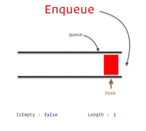
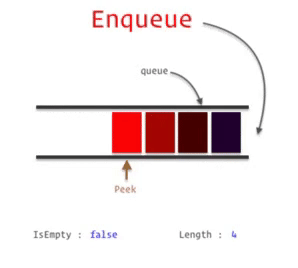
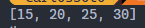

<h1>Introducción a Colas</h1>

<p align="justify">Es una colección de elementos que se agregan y quitan basándose en el principio de <b>primero en entrar-primero en salir</b>(<strong>FIFO, First In-First Out</strong>).</p>

<p align="center">

</p>

<p align="justify">Esto quiere decir que el primer elemento en ser insertado es el primero en ser eliminado. Un elemento puede ser agregado en cualquier momento a una cola, esto se hace por el final, pero solo se puede acceder o eliminar el elemento que esté en el frente de la misma.</p>

<p align="justify">Existen dos actividades o eventos que administran los elementos de una cola, dichos eventos son:</p>  

<p align="justify"><strong>Enqueue o Poner en cola:</strong>Cuando se agrega un nuevo elemento a la cola.</p>

<p align="center">

</p>

<p align="justify"><strong>Dequeue o Sacar de la cola:</strong>Cuando se elimina un elemento de la cola.</p>

<p align="center">

</p>

<h4>Se presenta una lista de los métodos que usará la clase de Cola:</h4>

<ul>
    <li>Crear</li>
    <li>Enqueue-Arribo</li>
    <li>Dequeue-Atencion</li>
    <li>Es vacio</li>
    <li>Tamaño</li>
    <li>Listar</li>
    <li>Cima</li>
</ul>

<h5>Para complementar la cola, necesitamos crear una clase nodo, la cual es la siguiente:</h5>

<h4>Clase NODO:</h4>

```python
class Nodo: 
    def __init__(self, dato): 
        self.dato = dato 
        self.siguiente = None
```

<ul>
    <li>
    <p align="justify">Dato: Dato que contendrá el nodo, string, number, boolean, etc.</p> 
    </li>
    <li><p align="justify">Siguiente: Es el apuntador que contendrá la referencia en memoria del siguiente nodo.</p></li>
</ul>

```python
from Nodo import Nodo

class Cola():
    def __init__(self):
        self.frente = None
        self.final = None
        self.tamanio = 0
    ......
```

<h4>Métodos de la clase:</h5>

<h5>Es vacio:</h5>
<p align="justify">Método para saber si la cola se encuentra vacía, si esta vacío retorna True, en caso contrario False.</p>

```python
def esVacio(self):
    return self.frente is None
```

<h5>Enqueue o Arribo:</h5>
<p align="justify">Inserta el elemento al final de la cola.</p>

```python
def arribo(self, dato):
    nodo_nuevo = Nodo(dato)
    if self.frente is None:
        self.frente = nodo_nuevo
    else:
        self.final.siguiente = nodo_nuevo
    self.final = nodo_nuevo
    self.tamanio += 1
```

<h5>Dequeue o Atención:</h5>
<p align="justify">Elimina y devuelve el elemento almacenado en el frente de la cola.</p>

```python
def atencion(self):
    dato = self.frente.dato
    self.frente = self.frente.siguiente
    if self.frente is None:
        self.final = None
    self.tamanio -= 1
    return dato
```

<h5>Tamaño:</h5>
<p align="justify">Devuelve la cantidad de elementos en la cola.</p>

```python
def getTamanio(self):
    return self.tamanio
```

<h5>En frente:</h5>
<p align="justify">Devuelve el valor del elemento que está almacenado en el frente de la cola sin eliminarlo.</p>

```python
def en_frente(self):
    return str(self.frente.dato)
```

<h5>Mover al final:</h5>
<p align="justify">Devuelve el valor del elemento que está almacenado en el frente de la cola sin eliminarlo.</p>

```python
def en_frente(self):
    return str(self.frente.dato)
```

<h5>Listar:</h5>
<p align="justify">Muestra cada elemento en la cola, recorriendo uno por uno cada elemento de la cola.</p>

```python
def listar(self):
    aux = self.frente
    if (self.esVacio()):
        return print("La cola esta vacia")
    self.temp = []
    while aux != None:
        self.temp.append(aux.dato)
        aux = aux.siguiente
    print(self.temp)
```
<p align="justify">Imaginemos que tenemos los siguientes números en la cola: 10,20,25,30. Se muestra los datos en la cola:</p>

<h4>Demostración gráfica:</h4>
<p align="center">

</p>

<p align="justify">Código completo a continuación:</p>

```python
class Nodo: 
    def __init__(self, dato): 
        self.dato = dato 
        self.siguiente = None

class Cola():
    def __init__(self):
        self.frente = None
        self.final = None
        self.tamanio = 0
    
    def getTamanio(self):
        return self.tamanio
    
    def arribo(self, dato):
        #* Arriba el dato al final de la cola
        nodo_nuevo = Nodo(dato)
        if self.frente is None:
            self.frente = nodo_nuevo
        else:
            self.final.siguiente = nodo_nuevo
        self.final = nodo_nuevo
        self.tamanio += 1
    
    def atencion(self):
        #* Atiende el elemento en el frente de la cola y lo devuelve
        dato = self.frente.dato
        self.frente = self.frente.siguiente
        if self.frente is None:
            self.final = None
        self.tamanio -= 1
        return dato

    def esVacio(self):
        #* Devuelve true si la cola esta vacia
        return self.frente is None
    
    def en_frente(self):
        #* Devuelve el valor almacenado en el frente de la cola
        return str(self.frente.dato)
    
    def getTamanio(self):
        return self.tamanio
    
    def mover_al_final(self):
        #* Mueve el elemento del frente de la cola al final
        dato = self.atencion()
        self.arribo(dato)
        return dato

    def listar(self):
        aux = self.frente
        if (self.esVacio()):
            return print("La cola esta vacia")
        self.temp = []
        while aux != None:
            self.temp.append(aux.dato)
            aux = aux.siguiente
        print(self.temp)
```

<p align="justify">Listo!!!, ahora implementen su cola.</p>


<p align="justify">Referencias:</p>
<ul>
    <li><a href="https://www.studytonight.com/data-structures/queue-data-structure" target="_blank">Cola (Study tonight)</a></li>
    <li><a href='https://dev.to/damimd10/data-structures-part-1-queues-how-to-implement-5fme' target="_blank">DEV</a></li>
    <li>funcionamiento gráfico de la listas simple: <a href='https://visualgo.net/en/list' target="_blank">Visualgo</a></li>
</ul>

<p align="center"><a href="./Memoriadinamica.md">Inicio</a></p>