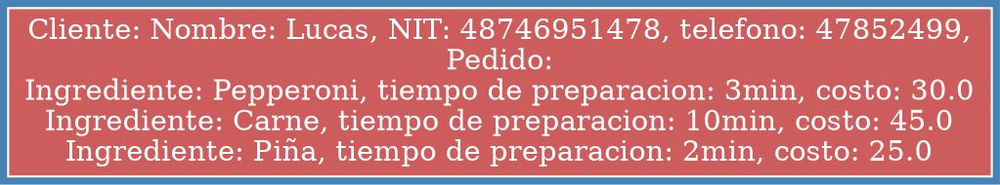
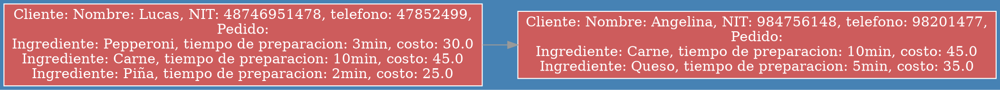
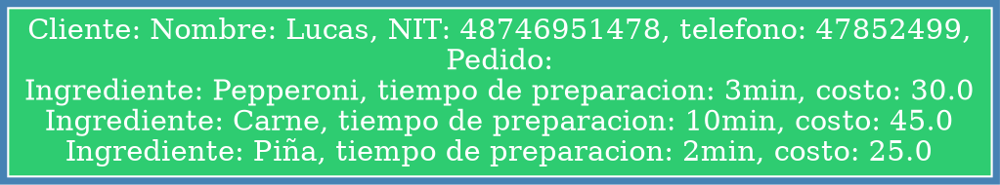
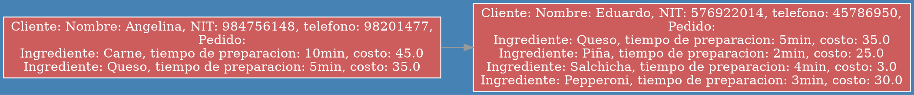

<h1>Ejemplo de Cola con TDA graficando con Graphviz</h1>

<p align="justify">Bien para el ejemplo crearemos las clases y metodos necesarios para crear la cola, recorrerla y graficarla, tambien sera necesario importar algunas librerias, entre las cuales estan:</p>

<ul>
    <li>graphviz</li>
    <li>os</li>
    <li>nodoLista</li>
</ul>

<p align="justify">Para manejar este ejemplo y que será con un TDA, se hablará sobre una pizzeria, que atiende la orden de sus clientes entre los  5 tipos de pizza que ofrecen y ademas cada orden debe tomar cierto tiempo para que este lista la orden del cliente. Empecemos listando las clases necesarias:</p>

<ul>
    <li>Pizza</li>
    <li>Lista de pizzas</li>
    <li>Cliente</li>
    <li>NodoOrden</li>
    <li>Orden</li>
    <li>ColaOrden</li>
    <li>funciones</li>
    <li>main</li>
</ul>

<p align="justify">Estas serán todas las clases y módulos a utilizar.</p>

### Clase Pizza (Nodo Pizza):

```python
class Pizza():    
    def __init__(self, ingrediente, tiempo, costo):
        self.ingrediente = ingrediente
        self.tiempo = tiempo
        self.costo = costo
        self.siguiente = None
    
    def getIngrediente(self):
        return self.ingrediente
    
    def getTiempo(self):
        return self.tiempo
    
    def getCosto(self):
        return self.costo
    
    def __str__(self):
        return f"Ingrediente: {self.ingrediente}, tiempo de preparacion: {self.tiempo}min, costo: {self.costo}"
```

<p align="justify">Almacena la información de la pizza.</p>

### Clase Lista Pizza  (Lista simple):

```python
from Pizza import Pizza

class lista_pizzas():

    def __init__(self):
        self.primero = None
        self.ultimo = None
        self.size = 0
    
    def isEmpty(self):
        return self.primero == None
    
    def getSize(self):
        return self.size
    
    def insertarAlFinal(self, ingrediente, tiempo, costo):
        if self.isEmpty():
            self.primero = self.ultimo = Pizza(ingrediente, tiempo, costo)
        else:
            aux = self.ultimo
            self.ultimo = Pizza(ingrediente, tiempo, costo)
            aux.siguiente = self.ultimo
        self.size += 1
    
    
    def eliminarAlInicio(self):
        if self.isEmpty():
            print("Lista de pizzas vacias")
        elif self.primero == self.ultimo:
            self.primero = self.ultimo = None
        else:
            self.primero = self.primero.siguiente
            
    def enlistarPizzas(self):
        listaDePizzas = ""
        if self.isEmpty():
            return "\nLa lista de pizzas esta vacia"
        aux = self.primero
        while aux:
            listaDePizzas += f"{aux}\n"
            aux = aux.siguiente
        return listaDePizzas #*Devuelve las pizzas en String
        
    def mostrarPizzas(self):
        if self.isEmpty():
            return print(f"La lista de pizzas esta vacia")
        aux = self.primero
        while aux:
            print(aux)
            aux = aux.siguiente
        print("\n")
```

<p align="justify">La lista pizza sera una lista simple, para llevar el control de cuantas pizzas se estan comprando en cada orden.</p>

### Clase Cliente:

```python
class Cliente():
    
    def __init__(self, nombre, nit, telefono):
        self.nombre = nombre
        self.nit = nit
        self.telefono = telefono
        
    def getNombre(self):
        return self.nombre
    
    def getNit(self):
        return self.nit
    
    def getTelefono(self):
        return self.telefono
    
    def __str__(self):
        return f"Nombre: {self.nombre}, NIT: {self.nit}, telefono: {self.telefono}"
```

<p align="justify">La clase cliente toma y almacena los datos del cliente, su nombre, nit y telefono en este caso.</p>

### Clase nodoOrden:

```python
class nodoOrden():

    def __init__(self, dato):
        self.dato = dato
        self.siguiente = None
    
    def getDato(self):
        return self.dato
```

<p align="justify">Es el nodo que almacenara un objeto de tipo orden.</p>


### Clase Orden:

```python
from lista_pizzas import lista_pizzas
from Cliente import Cliente
from graphviz import Digraph
from os import system, startfile

class Orden():

    def __init__(self, nombre, nit, telefono):
        self.cliente = Cliente(nombre, nit, telefono)
        self.pizzas = lista_pizzas()
    
    def getCliente(self):
        return self.cliente
    
    def getPizzas(self):
        return self.pizzas
    
    #Grafica el pedido realizado
    def showOrden(self):
        cont = 0
        dot  = Digraph("G", format="png", graph_attr={"rankdir":"LR", "bgcolor":"steelBlue"},
                        node_attr={"style":"filled", "shape":"rect"},
                        edge_attr={"color":"#999999", "fontcolor":"#888888"})
        
        dot.node(f"node{str(cont)}", self.__str__() ,{"color":"white", "fontcolor":"white", "fillcolor":"#2ECC71"})
            
        nombre = "pedido_realizado"
        dot.save(filename=f"{nombre}.dot", directory="../practica 1/")
        system(f"dot -Tpng {nombre}.dot -o {nombre}.png")
        startfile(f"{nombre}.png")
    
    def __str__(self):
        return f"Cliente: {self.cliente},\nPedido:\n{self.pizzas.enlistarPizzas()}"
```

<p align="justify">La clase orden crea objetos de tipo orden que serán almacenados como un nodoOrden dentro de la cola de ordenes.</p>

### Clase Cola Orden:

```python
from nodoOrden import nodoOrden
from graphviz import Digraph
from os import system, startfile

class colaOrden():
    
    def __init__(self):
        self.primero = None
        self.ultimo = None
        self.size = 0
    
    def isEmpty(self):
        return self.primero == None
    
    def agregarAlFinal(self,dato):
        if self.isEmpty():
            self.primero = self.ultimo = nodoOrden(dato)
        else:
            aux = self.ultimo
            self.ultimo = nodoOrden(dato)
            aux.siguiente = self.ultimo
        self.size += 1
    
    #Devuelve el objeto de tipo Orden
    def eliminarAlInicio(self):
        ordenTerminada : Orden = None
        self.size += 1
        if self.isEmpty():
            return None
        elif self.primero == self.ultimo:
            ordenTerminada = self.primero
            self.primero = self.ultimo = None
            return ordenTerminada.dato #Se devuelve la Orden  
        else:
            ordenTerminada = self.primero
            self.primero = self.primero.siguiente
            return ordenTerminada.dato #Se devuelve la Orden

    #Graficar la cola 
    def showIMG(self):
        actual = self.primero
        cont = 0
        dot  = Digraph("G", format="png", graph_attr={"rankdir":"LR", "bgcolor":"steelBlue"},
                        node_attr={"style":"filled", "shape":"rect"},
                        edge_attr={"color":"#999999", "fontcolor":"#888888"})
        while actual:
            dot.node(f"node{str(cont)}", str(actual.dato),{"color":"white", "fontcolor":"white", "fillcolor":"IndianRed"})
            if actual != self.primero:
                dot.edge(f"node{str(cont-1)}", f"node{str(cont)}")
            actual = actual.siguiente
            cont += 1
        nombre = "cola_actual"
        dot.save(filename=f"{nombre}.dot", directory="../practica 1/")
        system(f"dot -Tpng {nombre}.dot -o {nombre}.png")
        startfile(f"{nombre}.png")
        
    def mostrarOrdenes(self):
        print("\nLista de ordenes disponibles:")
        if self.isEmpty():
            print("La lista de ordenes esta vacia")
        aux = self.primero
        while aux:
            print(aux.dato)
            aux = aux.siguiente
```

<p align="justify">La clase cola orden almacena objetos de tipo orden que contenidos como un nodoOrden dentro de la cola de ordenes.</p>

### Módulo funciones:

```python
from colaOrden import colaOrden
from orden import Orden

global ordenes
ordenes = None


def menu():
    global ordenes
    ordenes = colaOrden()

    opcion = None

    while True:

        informacion = """ 
--Bienvenido a pizzaLandia--
1.Crear orden
2.Listar ordenes
3.Despachar orden
4.Datos del desarrollador
5.Salir
    """
        print(informacion)
        opcion = int(input("¿Qué acción desea realizar?"))
        if (opcion == 1):
            crearOrden()
        elif (opcion == 2):
            ordenes.showIMG()
            ordenes.mostrarOrdenes()
        elif (opcion == 3):
            pedido_listo = ordenes.eliminarAlInicio()
            if (pedido_listo != None):
                pedido_listo.showOrden()
                if ordenes.size != 0:
                    ordenes.showIMG()
                    ordenes.mostrarOrdenes()
            else:
                print(("Lista de ordenes vacia"))
        elif (opcion == 4):
            datosDesarrollador()
        elif (opcion == 5):
            print("\nNos vemos, vuelva pronto!\n")
            break
        else:
            print("Has seleccionado una opcion no valida \n")


def crearOrden():
    global ordenes
    nombre = nit = telefono = None
    masPizza = True

    print("Bienvenido Cliente, porfavor siga las siguientes instrucciones:")

    nombre = input("Ingrese su nombre: ")
    nit = input("Ingrese su NIT: ")
    telefono = input("Ingrese su telefono: ")

    if nombre != None and nit != None and telefono != None:
        orden = Orden(nombre, nit, telefono)
        tipos_de_pizzas = """
----------------------------------
|\| Ingrediente | Tiempo | Costo |
|1|  Pepperoni  |  3min  |  Q30  |
|2|  Salchicha  |  4min  |  Q30  |
|3|    Carne    |  10min |  Q45  |
|4|    Queso    |  5min  |  Q35  |
|5|     Piña    |  2min  |  Q25  |
----------------------------------
"""
        while masPizza:
            print(tipos_de_pizzas)
            opcion = input("Escoja el número de pizza que quiere comprar: ")
            if (opcion == "1"):
                orden.pizzas.insertarAlFinal("Pepperoni", 3, 30.0)
            elif (opcion == "2"):
                orden.pizzas.insertarAlFinal("Salchicha", 4, 3.0)
            elif (opcion == "3"):
                orden.pizzas.insertarAlFinal("Carne", 10, 45.0)
            elif (opcion == "4"):
                orden.pizzas.insertarAlFinal("Queso", 5, 35.0)
            elif (opcion == "5"):
                orden.pizzas.insertarAlFinal("Piña", 2, 25.0)
            else:
                print("Has seleccionado una pizza no existente \n")

            eleccion = input("¿Desea comprar mas pizzas?(SI/NO)")
            if eleccion.lower() != "si":
                masPizza = False

        if (orden.pizzas.getSize() >= 1):
            ordenes.agregarAlFinal(orden)
            ordenes.mostrarOrdenes()
            ordenes.showIMG()
        else:
            print("Se eliminó su orden ya que no compró ninguna pizza")
    else:
        print("No ingreso uno de los datos pedidos")


def datosDesarrollador():
    datos = """ 
Introducción a la memoria dinámica
Desarrollador: Carlos Soto
Estructura de Cola emulada con listas enlazadas.
"""
    print(datos)
```

<p align="justify">El módulo funciones es el encargado de llevar el control del programa lleva el flujo del programa y esta pendiente de las acciones del usuario.</p>


### Módulo funciones:

```python
from funciones import menu

if __name__ == "__main__":
    menu()
```

<p align="justify">El módulo main es el encargado de arrancar el programa, haciendo un llamado a la función menú almacenada en el módulo de funciones.</p>

<p align="justify">Bien, en este punto ya tenemos creado nuestro programa, se debe de tomar en cuenta que cuando una orden este lista esta sale de la cola, y quedan las ordenes restantes pendientes, por tanto se podrán encontrar dos gráficas hechas con graphviz, una de la cola de ordenes,y otra de la orden atendida, La más importante ahora es la de la cola, se muestra a continuación:</p>

```python
def showIMG(self):
    actual = self.primero
    cont = 0
    dot  = Digraph("G", format="png", graph_attr={"rankdir":"LR", "bgcolor":"steelBlue"},
                    node_attr={"style":"filled", "shape":"rect"},
                    edge_attr={"color":"#999999", "fontcolor":"#888888"})
    while actual:
        dot.node(f"node{str(cont)}", str(actual.dato),{"color":"white", "fontcolor":"white", "fillcolor":"IndianRed"})
        if actual != self.primero:
            dot.edge(f"node{str(cont-1)}", f"node{str(cont)}")
        actual = actual.siguiente
        cont += 1
    nombre = "cola_actual"
    dot.save(filename=f"{nombre}.dot", directory="../practica 1/")
    system(f"dot -Tpng {nombre}.dot -o {nombre}.png")
    startfile(f"{nombre}.png")
```

<p align="justify">El método showIMG, es el encargado de realizar la imagen de la cola. Realizamos un ejemplo, imaginemos que tres personas irán a comprar pizzas al centro comercial, al nuevo local que se abrió recientemente,las personas tiene los siguientes nombres: Lucas, Angelina, y Eduardo. Cada uno llega al nuevo local en el mismo orden en que los mostramos anteriormente. Entonces les empezaremos a tomar orden conforme la cola que hicieron.</p>

<p align="justify">El primero en pasar es Lucas, le piden su nombre, nit y número de telefono, luego de esto le preguntan que tipo de pizzas comprará, y se lleva una de Pepperoni, otra de Carne y una de Piña, en ese momento su orden entra en cola, se muestra a continuación la cola:</p>

<center>



</center>

<p align="justify">Se ve de color rojo de fondo, ya que se encuentra en la cola. Luego de esto [asa Angelina, y nuevamente le piden sus datos y las pizzas que comprará, ella se llevará una pizza de carne y una pizza de queso. Quedando así agregada su orden a la cola, se muestra a continuación:</p>


<center>



</center>

<p align="justify">Se sigue viendo de color rojo de fondo, ya que aun se encuentran las ordenes en cola. Luego de esto pasa Eduardo, y le piden sus datos y las pizzas a llevar, el llevará de queso, piña, salchica, y de pepperoni, Quedando así agregada su orden a la cola, se muestra a continuación:</p>

<center>



</center>

<p align="justify">Al parecer al terminar Eduardo de realizar su orden, la orden de Lucas ya se encuentra lista, miremos su orden y la actualización de la cola de ordenes:</p>

```graphviz
digraph G {
	graph [bgcolor=steelBlue rankdir=LR]
	node [shape=rect style=filled]
	edge [color="#999999" fontcolor="#888888"]
	node0 [label="Cliente: Nombre: Lucas, NIT: 48746951478, telefono: 47852499,
Pedido:
Ingrediente: Pepperoni, tiempo de preparacion: 3min, costo: 30.0
Ingrediente: Carne, tiempo de preparacion: 10min, costo: 45.0
Ingrediente: Piña, tiempo de preparacion: 2min, costo: 25.0
" color=white fillcolor=IndianRed fontcolor=white]
	node1 [label="Cliente: Nombre: Angelina, NIT: 984756148, telefono: 98201477,
Pedido:
Ingrediente: Carne, tiempo de preparacion: 10min, costo: 45.0
Ingrediente: Queso, tiempo de preparacion: 5min, costo: 35.0
" color=white fillcolor=IndianRed fontcolor=white]
	node0 -> node1
	node2 [label="Cliente: Nombre: Eduardo, NIT: 576922014, telefono: 45786950,
Pedido:
Ingrediente: Queso, tiempo de preparacion: 5min, costo: 35.0
Ingrediente: Piña, tiempo de preparacion: 2min, costo: 25.0
Ingrediente: Salchicha, tiempo de preparacion: 4min, costo: 3.0
Ingrediente: Pepperoni, tiempo de preparacion: 3min, costo: 30.0
" color=white fillcolor=IndianRed fontcolor=white]
	node1 -> node2
}

```

#### Orden completada de Lucas



#### Cola de ordenes actualizada



<p align="justify">Efectivamente, la orden de Lucas salio de la cola, nuestro método para graficar la cola de ordenes esta funcionando perfectamente!</p>

<p align="center"><a href="../graphviz.md">Regresar</a></p>