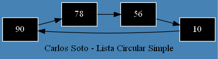

<h1>Ejemplo de lista circular con Graphviz</h1>

<p align="justify">Bien para el ejemplo crearemos las clases y metodos necesarios para crear la lista, recorrerla y graficarla, tambien sera necesario importar algunas librerias, entre las cuales estan:</p>

<ul>
    <li>graphviz</li>
    <li>os</li>
    <li>nodoLista</li>
</ul>

<h3>Clase nodo:</h3>

```python
class nodoLista(): 
    def __init__(self,dato): 
        self.dato = dato 
        self.siguiente = None
```

<h3>Clase Lista Circular:</h3>

```python
from graphviz import Digraph
from os import system, startfile
from nodoLista import nodoLista

class listaCircular():
    def __init__(self):
        self.primero = None
        self.ultimo = None
        self.size = 0
    
    def isVacia(self):
        return self.primero == None
    
    def agregarInicio(self, dato):
        if self.isVacia():
            self.primero = self.ultimo = nodoLista(dato)
            self.ultimo.siguiente = self.primero
        else:
            actual = nodoLista(dato)
            actual.siguiente = self.primero
            self.primero = actual
            self.ultimo.siguiente = self.primero
        self.size += 1
    
    def search_date(self,dato):
        if self.isVacia():
            print("La lista no tiene elementos")
            return 
        aux = self.primero
        while aux:
            #print(aux.dato, dato)
            if aux.dato == dato:
                print(f"Elemento encontrado: {dato}")
                break
            aux = aux.siguiente
            if aux == self.primero:
                print(f"Elemento no encontrado: {dato}")
                break
    
    def recorrido(self):
        aux = self.primero
        while aux:
            print(aux.dato)
            aux = aux.siguiente
            if aux == self.primero:
                break
```

<p align="">Hasta este punto la clase sigue siendo la misma hasta donde habiamos visto anteiormente. Ahora centremonos en el método de graficación, como bien mencionamos hay dos formas, a mano y la otra dada por la libreria de grahpviz dada por python. Mostraremos como usar ambas.</p>

### Forma 1:

```python
def graficar(self):
    dot = Digraph("G",comment="Lista circular simple", format="png", graph_attr={"label":"Carlos Soto - Lista Circular Simple","rankdir":"LR","bgcolor":"SteelBlue"},
    node_attr={"style":"filled", "shape":"rect"},
    edge_attr={"color":"#999999","fontocolor":"#888888"})
    cont = 1
    aux = self.primero
    while aux:
        dot.node(f"node{str(cont-1)}", str(aux.dato), {"color":"white", "fontcolor":"white", "fillcolor":"black"})
        if cont != self.size:
            dot.edge(f"node{str(cont-1)}", f"node{str(cont)}")
        else:
            dot.edge(f"node{str(cont-1)}", f"node{str(cont-self.size)}")
            
        aux = aux.siguiente
        cont += 1
        if aux == self.primero:
            break
    
    nombre = "lista_circular"
    dot.save(filename=f"{nombre}.dot", directory="../listas circulares/")
    system(f"dot -Tpng {nombre}.dot -o {nombre}.png")
    startfile(f"{nombre}.png")
```

<p align="justify">Este método hace uso de la librería que provee python, haciendo uso de sus métodos.</p>

### Forma 2:

```python
def graficarPasoaPaso(self):
    aux = self.primero
    cont = 0
    cadena = ""
    file = open('grafica.dot', 'w')
    cadena = cadena + 'digraph G { \n'
    cadena = cadena + '\t  label="Carlos Soto - Lista Circular Simple"\n'
    cadena = cadena + '\t  node[shape=box style=filled color="#ffffff" fontcolor="white" fillcolor="black"]\n'
    cadena = cadena + '\t  rankdir=LR\n'
    cadena = cadena + '\t  bgcolor="SteelBlue"\n'
    while(aux.siguiente != self.primero):
        cadena = cadena + 'Node'+str(cont)+'[label=\"'+str(aux.dato)+'\"];\n'
        if(aux != self.primero):
            cadena = cadena + 'Node'+str(cont-1)+' -> '+'Node'+str(cont)+';\n'
        cont+=1
        aux = aux.siguiente
    cadena = cadena + 'Node'+str(cont)+'[label=\"'+str(aux.dato)+'\"];\n'
    cadena = cadena + 'Node'+str(cont-1)+' -> '+'Node'+str(cont)+';\n'
    cadena = cadena + 'Node'+str(cont)+' -> '+'Node'+str(0)+';\n'
    cadena = cadena + '}'
    file.write(cadena)
    file.close()
    system('dot -Tpng grafica.dot -o grafica.png')
    startfile("grafica.png")
```

<p align="justify">Este método es el paso a paso sin necesidad de usar la libreria brindada por Python.</p>

<p align="justify">Los dos métodos realizan el mismo gráfico, e imaginemos que usaremos los siguientes números: 90,78,56, y 10, en la lista circular simple. Ahora 
mostramos su salida.</p>

<p align="center">

</p>

<p align="justify">El código dot queda de la siguiente forma:</p>

```code
// Lista circular simple
digraph G {
	graph [bgcolor=SteelBlue label="Carlos Soto - Lista Circular Simple" rankdir=LR]
	node [shape=rect style=filled]
	edge [color=black fontocolor="#888888"]
	node0 [label=90 color=white fillcolor=black fontcolor=white]
	node0 -> node1
	node1 [label=78 color=white fillcolor=black fontcolor=white]
	node1 -> node2
	node2 [label=56 color=white fillcolor=black fontcolor=white]
	node2 -> node3
	node3 [label=10 color=white fillcolor=black fontcolor=white]
	node3 -> node0
}
```

<p align="center"><a href="../graphviz.md">Regresar</a></p>