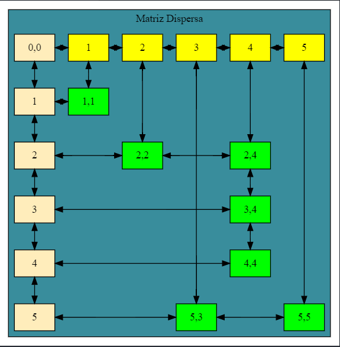
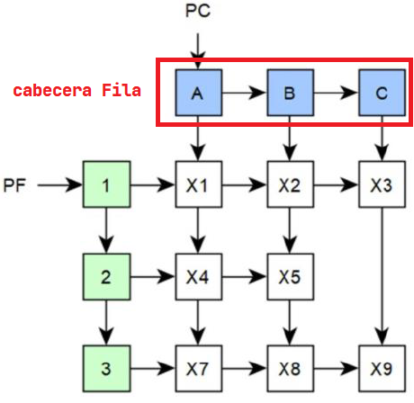
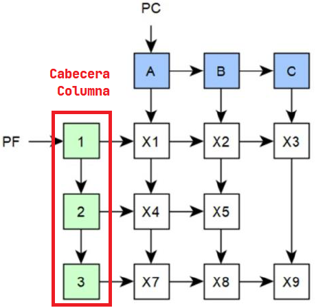
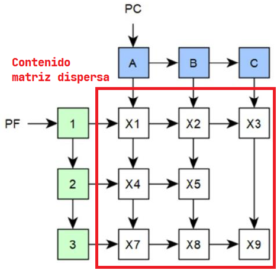

<h1>Introducción a Matriz dispersa</h1>

Son matrices en las cuales existen gran cantidad de valores nulos o ceros. El aprovechamiento de este conocimiento permite reducir el costo computacional de las operaciones que se pueden llegar a realizar sobre estas matrices, así como el costo espacial para el almacenamiento de la información.

Existen diversas formas de implementar una matriz dispersa:

<ul >
    <li>
        <strong>Arreglos:</strong>
        <ul>
            <li>
Existe desperdicio de memoria. Las posiciones 0 (Nulas) existen.
</li>
        </ul>
    </li>
    <li>
        <strong>Lista Enlazada:</strong>
        <ul>
            <li>
Problemas de rendimiento (inserción, eliminación, y búsqueda).
</li>
        </ul>
    </li>
    <li>
        <strong>Enlaces de datos:</strong>
        <ul>
            <li>
Mejora el rendimiento, pero consume memoria adicional almacenando los valores de X,Y en los nodos.
</li>
        </ul>
    </li>
    <li>
        <strong>Listas con Cabecera:</strong>
        <ul>
            <li>
Mejora el rendimiento y reduce el consumo de memoria solo almacenando una sola coordenada en los nodos.
</li>
        </ul>
    </li>
</ul>

En nuestro caso implementaremos las listas con cabecera, para la matriz dispersa.

<h4>Se presenta una lista de los métodos que usará la clase de Matriz Dispersa:</h4>

<ul>
    <li>Crear</li>
    <li>Insertar</li>
    <li>Recorrido por Fila</li>
    <li>Recorrido por Columna</li>
    <li>Ubicar Coordenada</li>
    <li>Mostrar Matriz</li>
</ul>

Al implementar las listas con cabecera, se usaran listas dobles, a continuación toda la explicación para implementar una matriz dispersa.

Algunos datos en tomar en cuenta son:

<ul>
    <li>Puede ser una lista simple o doble, en la cual los elementos se insertan ordenados.</li>
    <li>Cada nodo de la estructura guarda únicamente su valor y los apuntadores necesarios.</li>
    <li>No existe desperdicio de memoria.</li>
    <li>El rendimiento de las operaciones es óptimo.</li>
    <li>Dependiendo de la implementación puede tener una complejidad adicional al enlazar los datos.</li>
</ul>

Al implementar las listas con cabecera, se tiene que tomar en cuenta que se usarán listas doblemente enlazadas, para las cabeceras. 

<h4>Lista Cabecera por Fila</h4>

<h4>Lista Cabecera por Columna</h4>

<h4>Contenido Matriz Dispersa</h4>

