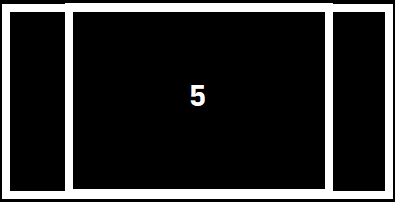

<h1>Introducción a Matriz dispersa</h1>

<p align="justify">Son matrices en las cuales existen gran cantidad de valores nulos o ceros. El aprovechamiento de este conocimiento permite reducir el costo computacional de las operaciones que se pueden llegar a realizar sobre estas matrices, así como el costo espacial para el almacenamiento de la información.</p>

<p align="center">

</p>

<p align="justify">Existen diversas formas de implementar una matriz dispersa:</p>

<ul >
    <li>
        <strong>Arreglos:</strong>
        <ul>
            <li><p align="justify">Existe desperdicio de memoria. Las posiciones 0 (Nulas) existen.</p></li>
        </ul>
    </li>
    <li>
        <strong>Lista Enlazada:</strong>
        <ul>
            <li><p align="justify">Problemas de rendimiento (inserción, eliminación, y búsqueda).</p></li>
        </ul>
    </li>
    <li>
        <strong>Enlaces de datos:</strong>
        <ul>
            <li><p align="justify">Mejora el rendimiento, pero consume memoria adicional almacenando los valores de X,Y en los nodos.</p></li>
        </ul>
    </li>
    <li>
        <strong>Listas con Cabecera:</strong>
        <ul>
            <li><p align="justify">Mejora el rendimiento y reduce el consumo de memoria solo almacenando una sola coordenada en los nodos.</p></li>
        </ul>
    </li>
</ul>

<p align="justify">En nuestro caso implementaremos las listas con cabecera, para la matriz dispersa.</p>

<h4>Se presenta una lista de los métodos que usará la clase de Matriz Dispersa:</h4>

<ul>
    <li>Crear</li>
    <li>Insertar</li>
    <li>Recorrido por Fila</li>
    <li>Recorrido por Columna</li>
    <li>Ubicar Coordenada</li>
    <li>Mostrar Matriz</li>
</ul>

<p align="justify">Al implementar las listas con cabecera, se usaran listas dobles, a continuación toda la explicación para implementar una matriz dispersa.</p>

<p align="justify">Algunos datos en tomar en cuenta son:</p>
<ul>
    <li>Puede ser una lista simple o doble, en la cual los elementos se insertan ordenados.</li>
    <li>Cada nodo de la estructura guarda únicamente su valor y los apuntadores necesarios.</li>
    <li>No existe desperdicio de memoria.</li>
    <li>El rendimiento de las operaciones es óptimo.</li>
    <li>Dependiendo de la implementación puede tener una complejidad adicional al enlazar los datos.</li>
</ul>

<p align="justify">Al implementar las listas con cabecera, se tiene que tomar en cuenta que se usarán listas doblemente enlazadas, para las cabeceras. </p>

<h4>Lista Cabecera por Fila</h4>
<p align="center">

</p>
<h4>Lista Cabecera por Columna</h4>
<p align="center">

</p>
<h4>Contenido Matriz Dispersa</h4>
<p align="center">

</p>

<p align="justify">Para los ejemplos con las imagenes se usan listas simples para las cabeceras, pero ya en nuestro ejemplo, usaremos listas dobles.</p>

### Empezando con las cabeceras

<p align="justify">Bien lo primero que haremos sera crear las cabeceras, estan se irán creando en orden de menor a mayor, y nos darán acceso a la matriz. Las cabeceras pueden ser tanto filas como columnas.</p>

Lo primero que necesitamos crear es el nodo Cabecera:

```python
class NodoCabecera():
    def __init__(self, id):
        self.id = id
        self.siguiente = None
        self.anterior = None
        self.acceso = None
    
    def getAcceso(self):
        return self.acceso
    
    def setAcceso(self, nuevo_acceso):
        self.acceso = nuevo_acceso
```

<ul>
    <li>
    <p align="justify">Id: Es un valor entero, el cual será el identificador único del nodo.</p> 
    </li>
    <li><p align="justify">Siguiente: Es el apuntador que contendrá la referencia en memoria del siguiente nodo.</p></li>
    <li><p align="justify">Anterior: Es el apuntador que contendrá la referencia en memoria del anterior nodo.</p></li>
    <li><p align="justify">Acceso: Es el apuntador que contendrá la referencia en memoria de un nodo celda, un nodo celda, es un nodo propio de la matriz dispersa.</p></li>
</ul>

<p align="justify">Ahora, crearemos la clase ListaCebecera, que será una lista doblemente enlazada.</p>

```python
from NodoCabecera import NodoCabecera

class ListaCabecera():
    def __init__(self, tipo):
        self.primero = None
        self.ultimo = None
        self.tipo = tipo #* Si son Columnas o Filas
        self.size = 0
```

<ul>
    <li><p align="justify">Tipo: Es un string que contendrá el nombre del tipo de cabecera que será, ya sea una Fila o una columna.</p></li>
    <li><p align="justify">Size: Es un valor entero el cual llevará el conteo de cuantos nodos se tienen en la lista.</p></li>
</ul>

<p align="justify">Es hora de insertar los nodos a la lista!!!, toman en cuenta que los agregaremos en orden de menor a mayor. Mostamos el código a continuación e iremos explicando el código en partes luego:</p>

```python
def insertar_nodoCabecera(self, nuevo : NodoCabecera):
        self.size += 1
        if self.primero == None:
            self.primero = nuevo
            self.ultimo = nuevo
        else:
            # ---- Insercion en ORDEN
            # -- verificamos si el nuevo es menor que el primero
            if nuevo.id < self.primero.id:
                nuevo.siguiente = self.primero
                self.primero.anterior = nuevo
                self.primero = nuevo
            # -- verificamos si el nuevo es mayor que el ultimo
            elif nuevo.id > self.ultimo.id:
                self.ultimo.siguiente = nuevo
                nuevo.anterior = self.ultimo
                self.ultimo = nuevo
            else:
                # -- sino, recorremos la lista para buscar donde acomodarnos, entre el primero y el ultimo
                tmp: Nodo_Cabecera = self.primero 
                while tmp != None:
                    if nuevo.id < tmp.id:
                        nuevo.siguiente = tmp
                        nuevo.anterior = tmp.anterior
                        tmp.anterior.siguiente = nuevo
                        tmp.anterior = nuevo
                        break
                    elif nuevo.id > tmp.id:
                        tmp = tmp.siguiente
                    else:
                        break
```

<p align="justify">Lo primero que hacemos es aumentar el contador size, ya que se está creando un nuevo nodo.</p>

```python
self.size += 1
```

<p align="justify">Luego de esto preguntaremos si el primer nodo esta vacio, si se cumple la condicion, el nuevo nodo será almacenado tanto en el nodo cabeza, como en el nodo cola.</p>

```python
if self.primero == None:
    self.primero = nuevo
    self.ultimo = nuevo
```

<p align="justify">En caso de que no se cumpla empezamos el resto de código, empezariamos con la inserción en orden, lo primero que preguntaremos será si el id del nuevo nodo es menor al id del nodo cabecera, si se cumple la validación, quiere decir que el id de nuevo si es menor al id del nodo cabecera, esto indica que el nuevo nodo debe ir antes que el nodo cabecera, validando eso con las siguientes líneas de código:</p>

```python
nuevo.siguiente = self.primero
self.primero.anterior = nuevo
self.primero = nuevo
```

<p align="justify">Dicho código realiza las uniones entre el nuevo nodo y el nodo cabecera, reemplazando el el valor que ya se tenia en el nodo cabecera por el valor del nuevo nodo, ya que el nuevo nodo es menor.</p>

<p align="justify">Sino, preguntaremos si el id del nuevo nodo es mayor que el id del nodo cola, en caso de que se cumpla, quiere decir que el nuevo nodo es mayor que el nodo cola, y por tanto debe ir de último, validando eso con las siguientes líneas de código:</p>

```python
self.ultimo.siguiente = nuevo
nuevo.anterior = self.ultimo
self.ultimo = nuevo
```

<p align="justify">En caso de que no se cumpla de que el id del nuevo nodo no sea menor al nodo cabecera o que el id del nuevo nodo no sea mayor al nodo cola, esto quiere decir que va en medio de ellos, para esto se tiene que realizar un recorrido desde el nodo cabecera, buscando su posición correcta. Y se vuelve a preguntar lo mismo que se hizo en las anteiores validaciones, validando eso con las siguientes líneas de código:</p>

```python
# -- sino, recorremos la lista para buscar donde acomodarnos, entre el primero y el ultimo
tmp: Nodo_Cabecera = self.primero 
while tmp != None:
    if nuevo.id < tmp.id:
        nuevo.siguiente = tmp
        nuevo.anterior = tmp.anterior
        tmp.anterior.siguiente = nuevo
        tmp.anterior = nuevo
        break
    elif nuevo.id > tmp.id:
        tmp = tmp.siguiente
    else:
        break
```

<p align="justify">Para una mejor explicación usaremos un ejemplo, Digamos que queremos insertar los números 10,5, 8 y 15. Empecemos queriendo insertar el número 10 a la lista cabecera. Mostrando el nodo nuevo a continuación:</p>

<p align="center">

</p>

<p align="justify">Como el nodo es nuevo no contiene conexiones, pero ahora lo insertamos a la lista cabecera y como es el primer nodo en ser insertados, tanto el nodo cabecera como el nodo cola harán sus respectivas conexiones con el nuevo nodo.</p>

<p align="center">

</p>

<p align="justify">Bien, en este punto ya se tiene insertado el nodo 10, es hora de insertar un nuevo nodo que tal el nodo con id 5.</p>

<p align="center">

</p>

<p align="justify">En la lista cabecera ya tenemos el nodo con el id 10, y queremos insertar el nodo con id 5, si preguntamos si el id del nuevo nodo es menor al id del nodo que ya se tiene dentro de la lista, es cierto si es menor, por tanto debe ir antes, insertanto el nuevo nodo y realizando sus debidas conexiones:</p>

<p align="center">

</p>

<p align="justify">Bien, en este punto ya se tiene insertado el nodo 5, es hora de insertar un nuevo nodo que tal el nodo con id 15.</p>

<p align="center">

</p>

<p align="justify">En la lista ya tenemos el nodo con el id 5 y 10, y queremos insertar el nodo con id 15, si preguntamos si el id del nuevo nodo es mayor al id del último nodo, nos daremos cuenta que si cumple la condición, insertanto el nuevo nodo y realizando sus debidas conexiones:</p>

<p align="center">

</p>

<p align="justify">Por último, en este punto ya se tiene insertado el nodo 5, 10 y 15 en orda, es hora de insertar un nuevo y último nodo que tal el nodo con id 8.</p>

<p align="center">

</p>

<p align="justify">En la lista ya se tiene el nodo con el id 5, 10 y 15, y queremos insertar el nodo con id 8, dicho nuevo nodo con el id  8 no es menor al id del nodo cabecera ni mayor al id del nodo cola, esto quiere decir que va en alguna posición en medio de ellos, por tanto empezariamos a recorrer desde el nodo cabecera pregunta si algun nodo con id es menor al nodo nuevo con dicho id, y en caso de que cumpla, se tiene que insertar el nuevo nodo luego del id del nodo que sea menor, insertanto el nuevo nodo y realizando sus debidas conexiones se tiene:</p>

<p align="center">

</p>

<p align="justify">Asi completando la inserción en orden de las listas cabeceras.</p>

<p align="justify">También podemos mostrar los nodos cabeceras y obtener un solo nodo cabecera.</p>

<strong>mostrar cabeceras:</strong>

```python
def mostrarCabeceras(self):
    tmp = self.primero
    while tmp != None:
        print('Cabecera', self.tipo, tmp.id)
        tmp = tmp.siguiente
```

<h4>Demostración gráfica:</h4>
<p align="center">  </p>

<strong>Obtener cabecera:</strong>

```python
def getCabecera(self, id): 
    #esta funcion debe retornar un nodo cabecera
        tmp = self.primero
        while tmp != None:
            if id == tmp.id:
                return tmp
            tmp = tmp.siguiente
        return None
```

<p align="justify">Ahora que ya sabemos como usar las listas cabecera, procedemos a crear la clase Celda y la clase Matriz Dispersa.</p>

### Clase Nodo Celda

<p align="justify">Se crea esta clase para manejar los nodos de la matriz, esto lo podemos ver como las celdas de excel, haciendo una comparativa. A continuación se presenta la clase:</p>

```python
class Nodo_Celda(): # Nodos ortogonales
    def __init__(self, x, y, caracter):
        # 'caracter' puede ser cualquier valor
        self.caracter = caracter
        self.coordenadaX = x  # fila
        self.coordenadaY = y  # columna
        self.arriba = None
        self.abajo = None
        self.derecha = None  # self.siguiente
        self.izquierda = None  # self.anterior

    def setArriba(self, arriba):
        self.arriba = arriba
    

    def getArriba(self):
        return self.arriba
    

    def setAbajo(self, abajo):
        self.abajo = abajo
    

    def getAbajo(self):
        return self.abajo


    def setDerecha(self, derecha):
        self.derecha = derecha
    

    def getDerecha(self):
        return self.derecha
    

    def setIzquierda(self, izquierda):
        self.izquierda = izquierda
    

    def getIzquierda(self):
        return self.izquierda
```

Donde:
<ul>
    <li><p align="justify">Caracter: Puede ser cualquier tipo o un TDA.</p></li>
    <li><p align="justify">Coordenada en X: Es la fila donde se encuentra ubicado el nodo Celda.</p></li>
    <li><p align="justify">Coordenada en Y: Es la columna donde se encuentra ubicado el nodo Celda.</p></li>
    <li><p align="justify">Arriba: Es el apuntador que contendrá la referencia en memoria del nodo de arriba.</p></li>
    <li><p align="justify">Abajo: Es el apuntador que contendrá la referencia en memoria del nodo de abajo.</p></li>
    <li><p align="justify">Derecha: Es el apuntador que contendrá la referencia en memoria del siguiente nodo.</p></li>
    <li><p align="justify">Izquierda: Es el apuntador que contendrá la referencia en memoria del anterior nodo.</p></li>
</ul>

### Clase Matriz Dipersa

<p align="justify">Se crea esta clase para manejar la matriz Dispersa. A continuación se presenta la clase:</p>

```python
from NodoCabecera import NodoCabecera
from ListaCabecera import ListaCabecera
from NodoCelda import NodoCelda

class MatrizDispersa():
    def __init__(self):
        self.capa = 0
        self.filas = Lista_Cabecera('fila')
        self.columnas = Lista_Cabecera('columna')
```

<p align="justify">Al crear el objeto de Matriz Dispersa, también se inicializa en el constructor dos listas Cabeceras, una para las filas y otra para las columnas.</p>

### Método de inserción

<p align="justify">Para este método se siguen unas pautas que se repiten varias veces, al ser iguales se globalizan y se muestra a continuación una lista de las mismas:</p>

<ul>
    <li><p align="justify">Lo primero, se crea un nodo celda a insertar.</p></li>
    <li><p align="justify">Luego, se busca si ya existen las cabeceras en la matriz.</p></li>
    <li><p align="justify"></p>Comprobamos si la cabecera existe.</li>
    <li><p align="justify">Comprobamos que el nodo no esta apuntando hacia ningun nodo Interno.</p></li>
    <li><p align="justify">Si esta apuntando, validamos si la posicion de la columna/fila del nueva_celda nodoInterno es menor a la posicion de la columna del acceso </p></li>
    <li><p align="justify">De no cumplirse debemos movernos de izquierda a derecha buscando donde posicionar el nueva_celda nodoInterno</p></li>
</ul>

<p align="justify">Dicho proceso se repite para insertar la nueva celda (nodo celda) tanto en columna como en fila, quedando así el código de inserción.</p>

```python
def insertar(self, pos_x, pos_y, caracter):
    nueva_celda = NodoCelda(pos_x, pos_y, caracter) # se crea nodo celda a insertar
    # --- lo prinero sera buscar si ya existen los cabeceras en la matriz
    nodo_X = self.filas.getCabecera(pos_x)
    nodo_Y = self.columnas.getCabecera(pos_y)

    if nodo_X == None: # --- comprobamos que el cabecera fila pos_x exista
        # --- si nodo_X es nulo, quiere decir que no existe cabecera fila pos_x
        nodo_X = NodoCabecera(pos_x)
        self.filas.insertar_nodoCabecera(nodo_X)

    if nodo_Y == None: # --- comprobamos que el cabecera columna pos_y exista
        # --- si nodo_Y es nulo, quiere decir que no existe  columna pos_y
        nodo_Y = NodoCabecera(pos_y)
        self.columnas.insertar_nodoCabecera(nodo_Y)

    ## ----- INSERTAR NUEVA_CELDA EN FILA
    if nodo_X.getAcceso() == None: # -- comprobamos que el nodo_x no esta apuntando hacia ningun nodoInterno
        nodo_X.setAcceso(nueva_celda)
    else: # -- si esta apuntando, validamos si la posicion de la columna del nueva_celda nodoInterno es menor a la posicion de la columna del acceso 
        if nueva_celda.coordenadaY < nodo_X.getAcceso().coordenadaY: # F1 --->  NI 1,1     NI 1,3      
            nueva_celda.setDerecha(nodo_X.getAcceso())        
            nodo_X.getAcceso().setIzquierda(nueva_celda)
            nodo_X.setAcceso(nueva_celda)
        else:
            #de no cumplirse debemos movernos de izquierda a derecha buscando donde posicionar el nueva_celda nodoInterno
            tmp : Nodo_Celda = nodo_X.getAcceso() 
            while tmp != None:                      
                if nueva_celda.coordenadaY < tmp.coordenadaY:
                    nueva_celda.setDerecha(tmp)
                    nueva_celda.setIzquierda(tmp.getIzquierda())
                    tmp.getIzquierda().setDerecha(nueva_celda)
                    tmp.setIzquierda(nueva_celda)
                    break;
                elif nueva_celda.coordenadaX == tmp.coordenadaX and nueva_celda.coordenadaY == tmp.coordenadaY: #validamos que no haya repetidas
                    break;
                else:
                    if tmp.getDerecha() == None:
                        tmp.setDerecha(nueva_celda)
                        nueva_celda.setIzquierda(tmp)
                        break;
                    else:
                        tmp = tmp.getDerecha()
    ## ----- INSERTAR NUEVA_CELDA EN COLUMNA
    if nodo_Y.getAcceso() == None:  # -- comprobamos que el nodo_y no esta apuntando hacia ningun nodoCelda
        nodo_Y.setAcceso(nueva_celda)
    else: # -- si esta apuntando, validamos si la posicion de la fila del nueva_celda nodoCelda es menor a la posicion de la fila del acceso 
        if nueva_celda.coordenadaX < nodo_Y.getAcceso().coordenadaX:
            nueva_celda.setAbajo(nodo_Y.getAcceso())
            nodo_Y.getAcceso().setArriba(nueva_celda)
            nodo_Y.setAcceso(nueva_celda)
        else:
            # de no cumplirse, debemos movernos de arriba hacia abajo buscando donde posicionar el nueva_celda
            tmp2 : Nodo_Celda = nodo_Y.getAcceso()
            while tmp2 != None:
                if nueva_celda.coordenadaX < tmp2.coordenadaX:
                    nueva_celda.setAbajo(tmp2)
                    nueva_celda.setArriba(tmp2.getArriba())
                    tmp2.getArriba().setAbajo(nueva_celda)
                    tmp2.setArriba(nueva_celda)
                    break
                elif nueva_celda.coordenadaX == tmp2.coordenadaX and nueva_celda.coordenadaY == tmp2.coordenadaY: #validamos que no haya repetidas
                    break;
                else:
                    if tmp2.getAbajo() == None:
                        tmp2.setAbajo(nueva_celda)
                        nueva_celda.setArriba(tmp2)
                        break
                    else:
                        tmp2 = tmp2.getAbajo()
    ##------ Fin de insercion
```

### Método de recorrido por Fila

<p align="justify">Dicho método como tal recorre una fila indicada por el usuario.</p>

```python
def recorridoPorFila(self, fila):
    inicio : Nodo_Cabecera = self.filas.getCabecera(fila)
    if inicio == None:
        print('Esa coordenada de filas no existe')
        return
        
    tmp : Nodo_Celda = inicio.getAcceso()
    #tmp = self.filas.getCabecera(fila).getAcceso()
    print(f"Fila : {fila}")
    print(end="| ")
    while tmp != None:
        print(tmp.caracter, end=" | ")
        tmp = tmp.getDerecha()
    print('')
```

### Método de recorrido por Columna

<p align="justify">Dicho método como tal recorre una fila indicada por el usuario.</p>

```python
def recorridoPorColumna(self, columna):
    inicio : Nodo_Cabecera = self.columnas.getCabecera(columna)
    if inicio == None:
        print('Esa coordenada de columna no existe')
        return

    tmp : Nodo_Celda = inicio.getAcceso()
    #tmp = self.filas.getCabecera(fila).getAcceso()
    while tmp != None:
        print(tmp.caracter)
        tmp = tmp.getAbajo()
```

### Método de Ubicar Coordenada

<p align="justify">Dicho método sirve para buscar una dato, por medio de sus coordenadas, en caso de que exista la coordenada se retorna el nodo celda, en caso de que no exista se muestra un mensaje diciendo que no se encontro la coordenada y retorna None.</p>

```python
def ubicarCoordenada(self, fila, columna):
    try:
        tmp : Nodo_Celda = self.filas.getCabecera(fila).getAcceso()
        while tmp != None:
            if tmp.coordenadaX == fila and tmp.coordenadaY == columna:
                return tmp
            tmp = tmp.getDerecha()
        return None
    except:
        print('Coordenada no encontrada')
        return None
```

### Método impresion de datos de la matriz

<p align="justify">Dicho método sirve imprimir los valores que almacena la matriz dispersa.</p>

```python
def printMatrixO(self):
    aux = tmp = None
    inicio = self.filas.getHead() #*Se obtiene el nodo cabeza de filas
    if(inicio != None):
        tmp = inicio.getAcceso() #*Se obtiene el primer nodo de la primera fila
        while (tmp != None):
            aux = tmp
            while (aux != None):
                print(aux.caracter + " ", end="")
                aux = aux.getDerecha()
            print("")
            tmp = tmp.getAbajo()
    else:
        return print("Matriz Vacia")
```

<h4>Demostración gráfica:</h4>
<p align="center">  </p>

<p align="justify">Listo!!!, ahora implementen su matriz Dispersa.</p>


<p align="justify">Referencias:</p>
<ul>
    <li><a href="https://programmerclick.com/article/46811042755/" target="_blank">Matriz dispersa - Programador click</a></li>
    <li><a href="https://github.com/Desconocido502/LAB-IPC2-D/tree/master/2022%20-%20Primer%20Semestre/Clase%208/C%C3%B3digo" target="_blank">Código Original</a></li>
</ul>


<p align="center"><a href="../Readme.md">Inicio</a></p>

<p align="justify">Agradecimiento especial a <a href="https://github.com/JavierLimaCS/">Javier Lima</a>, por la elaboración del código de matriz dispersa en Python.</p>

<!-- ```python

``` -->

<p align="justify"></p>