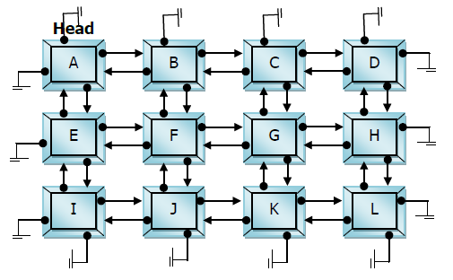
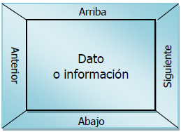

<h1>Introducción a Matriz Ortogonal</h1>

<p align="justify">Una matriz ortogonal es aquella en la que sus nodos se encuentran encadenados por cuatro ligas, es decir, cada nodo se encuentra doblemente ligado en forma horizontal y cada nodo se encuentra doblemente ligado en forma vertical. Siendo una derivación de lo que es una Matriz dispersa, que implementa una tabla con memoria dinámica. Contiene todos los métodos realizables por una lista enlazada de cualquier tipo.</p>

<p align="center">

</p>

<p align="justify">Algunos puntos a tomar en cuenta son:</p>

<ul>
    <li>Matriz MXN elementos</li>
    <li>Es considerado como un caso especial de una matriz dispersa.</li>
    <li>Generalmente utilizada cuando todos los elementos tienen un valor.</li>
    <li>La forma más eficiente de implementarlo, en cuestión de acceso, es mediante un arreglo.</li>
</ul>

### Nodo Ortogonal

<p align="justify">Debe contener como mínimo cinco campos, uno para almacenar la información (tipo de datos simple o TDA) y cuatro para guardar la dirección de memoria hacia el siguiente, anterior, arriba y abajo nodo de la lista.</p>

<p align="center">

</p>

### Métodos de la clase Matriz Ortogonal

<ul>
    <li>Crear</li>
    <li>Recorrer Lista</li>
    <li>Tamaño</li>
    <li>Agregar</li>
    <li>Esta vacio</li>
    <li>Buscar Dato</li> 
    <li>Auto Llenado</li> 
</ul>

<p align="justify">Bien antes de avanzar, necesitamos la clase de nodo Ortogonal, la cual se presenta a continuación:</p>

```python
class NodoOrtogonal():
    def __init__(self, fila, columna, caracter):
        self.fila = fila
        self.columna = columna
        self.caracter = caracter
        self.anterior = None
        self.siguiente = None
        self.arriba = None
        self.abajo = None
    
    def getFila(self):
        return self.fila
    
    def getColumna(self):
        return self.columna
    
    def getCaracter(self):
        return self.caracter
    
    def setArriba(self, arriba):
        self.arriba = arriba

    def getArriba(self):
        return self.arriba
    
    def setAbajo(self, abajo):
        self.abajo = abajo
    
    def getAbajo(self):
        return self.abajo
    
    def setSiguiente(self, siguiente):
        self.siguiente = siguiente
    
    def getSiguiente(self):
        return self.siguiente
    
    def setAnterior(self, anterior):
        self.anterior = anterior
    
    def getAnterior(self):
        return self.anterior
```

<ul>
    <li>
    <p align="justify">Fila: Es un valor entero, el cual será el identificador de la fila en que se encuentra el nodo.</p> 
    </li>
    <li><p align="justify">Columna: Es un valor entero, el cual será el identificador de la columna en que se encuentra el nodo.</p></li>
    <li><p align="justify">Caracter: Es el encargado de almacenar un dato de tipo primitivo o un TDA.</p></li>
    <li><p align="justify">Siguiente: Es el apuntador que contendrá la referencia en memoria del siguiente nodo.</p></li>
    <li><p align="justify">Anterior: Es el apuntador que contendrá la referencia en memoria del anterior nodo.</p></li>
    <li><p align="justify">Arriba: Es el apuntador que contendrá la referencia en memoria del nodo de arriba.</p></li>
    <li><p align="justify">Abajo: Es el apuntador que contendrá la referencia en memoria del nodo de abajo.</p></li>
</ul>

<p align="justify">Ahora presentamos la clase de Matriz Dispersa</p>

```python
from NodoOrtogonal import NodoOrtogonal

class MatrizOrtogonal():
    def __init__(self):
        self.head = None
        self.size = 0 
        self.SizeG = 0
```

Donde:

<ul>
    <li>
    <p align="justify">Head: Es el nodo cabeza de la matriz.</p> 
    </li>
    <li><p align="justify">size: Es un valor entero, el cual sirve para el proceso de inserción de datos.</p></li>
    <li><p align="justify">sizeG: Es un valor entero, el cual lleva el conteo del número de nodos dentro del la matriz.</p></li>
</ul>

### Método getHead

<p align="justify">Sirve para retornar la el nodo cabeza de la matriz.</p>

```python
def getHead(self):
    return self.head
```
### Método getSizeG

<p align="justify">Retorna el número total de nodos en la matriz.</p>

```python
def getSizeG(self):
    return self.SizeG
```

### Método vacio

<p align="justify">Sirve para retornar si la matriz se encuentra vacia o no.</p>

```python
def vacio(self):
    return self.head == None
```

### Método auto Filling

<p align="justify">Es un método de autollenado, al cual simplemente se le pasa el tamaño de la matriz por medio de filas y columnas, y el tipo de caracter string que se le desee colocar.</p>

```python
def autofilling(self, fila, columna, caracter):
    for i in range(1, fila + 1):
        for j in range(1, columna + 1):
            self.insertData(i, j, caracter)
```
### Método insercion de los datos

<p align="justify">Es un método para insertar datos, se encarga de realizar todas las conexiones entre los nodos.</p>

```python
def insertData(self, fila, columna, caracter):
    self.SizeG += 1
    if self.vacio():
        new_node = NodoOrtogonal(fila, columna, caracter)
        self.head = new_node
        self.size += 1
    else:
        aux = self.head
        while aux.abajo != None:
            aux = aux.abajo
        if self.size != fila:
            self.size += 1
            new_node = NodoOrtogonal(fila, columna, caracter)
            aux.abajo = new_node
            new_node.arriba = aux
        else:
            while aux.siguiente != None:
                aux = aux.siguiente
            new_node = NodoOrtogonal(fila, columna, caracter)
            aux.siguiente = new_node
            new_node.anterior = aux
            if self.size > 1:
                aux2 = aux.arriba.siguiente
                aux2.abajo = new_node
                new_node.arriba = aux2
```
### Método busqueda de un dato

<p align="justify">Es un método para un dato, mediante una fila y una columna, retornando el dato encontrado si existe dicha posición, de lo contrario retorna un mensaje notificando que no existe dicho posición. O que la matriz esta vacia.</p>

```python
def searchData(self, fila, columna):
    tmp = aux = None
    if (self.head != None):
        tmp = self.head
        while tmp != None:
            aux = tmp
            while aux != None:
                if (int(fila) == int(aux.fila) and int(columna) == int(aux.columna)):
                    return aux.caracter #*Retorna el dato
                aux = aux.siguiente
            tmp = tmp.abajo
        return None #*Devuelve nulo o vacio en caso de no encontrar el nodo con esas posiciones
    else:
        print("Matriz vacia")
        return 
```

### Método Impresion de datos de la matriz

<p align="justify">Es un método para la impresión de datos contenidos o almacenados dentro de la matriz.</p>

```python
def printMatrixO(self):
    tmp = aux = None
    if (self.head != None):
        tmp = self.head
        while tmp != None:
            aux = tmp
            while aux != None:
                print(aux.caracter + " ", end="")
                aux = aux.siguiente
            print("")
            tmp = tmp.abajo
    else:
        return print("Matriz vacia")
```

<h2>Demostración gráfica:</h2>
<p align="center">

</p>

<p align="justify">Listo!!!, ahora implementen su matriz Ortogonal.</p>

<p align="justify">Referencias:</p>
<ul>
    <li><a href="https://www.rdebug.com/2010/10/matriz-ortogonal-estructura-de-datos-en.html" target="_blank">Matriz ortogonal</a></li>
</ul>

<p align="center"><a href="../Readme.md">Inicio</a></p>