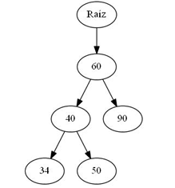

<h1>Introducción a Graphviz</h1>

<p align="center">

</p>

<p align="justify">Graphviz es un programa de visualización gráfica de fuente abierta. La visualización de gráficos es una forma de representar información estructural como diagramas de redes y gráficos abstractos. Tiene aplicaciones importantes en redes, bioinformática, ingeniería de software, diseño web y de bases de datos, aprendizaje automático y en interfaces visuales para otros dominios técnicos.</p>

## Lenguaje Dot

<p align="justify">Es la herramienta principal para dibujar estructuras jerárquicas o de capas dirigidas que puede ejecutarse como un programa desde la línea de comandos.</p>

<p align="justify">Dibuja figuras con nodos dirigidos mediante líneas ó flechas. Puede leer archivos de texto que contienen las descripciones de las figuras y crea imágenes que pueden ser almacenadas en archivos gráficos con diversos formatos como JPG, GIF, PNG, SVG, PDF, PostScript, etc.</p>

<p align="center">

</p>

<p align="justify">Dot tiene una <a href="https://graphviz.org/doc/info/lang.html">gramática</a> muy completa que permite manipular varios aspectos de la imagen generada. Para crear una estructura básica, sigamos las siguientes instrucciones:</p>

1. **Definir el tipo y el nombre de la gráfica:** En la primera línea debe de colocar el tipo y el nombre de la figura que se desea gráficar.

2. **Colocar los nodos y sus relaciones:** Después de definir el tipo y nombre de la figura, las siguientes líneas de código crean los nodos y sus relaciones mediante líneas ó flechas.

3. Si se desean dibujar nodos unidos mediante flechas se usa el tipo *digraph*, en cambio si las relaciones entre los nodos no requieren dirección, se usa un esquema de tipo *graph*.

4. Las definiciones de los nodos y sus relaciones se colocan entre los símbolos *{* y *}*.

5.  Un nodo se crea cuando su nombre aparece al principio de la línea.
    a. Su relación con otro nodo se genera por medio del operador -> para relaciones dirigidas (con punta de flecha).
    b. su relación con otro nodo se genera por medio del operador -- para relaciones no dirigidas (sin punta de flecha).

6. Cuando se desea etiquetar cada relación con un valor, se coloca la sentencia [label=valor].

7. Cada definición de los nodos y sus relaciones debe terminar con el símbolo de puntuación del punto y coma ( ; ).

<p align="justify">A continuación un ejemplo básico:</p>

```code
digraph Figura { 
    Raíz->60; 
    60->40; 
    60->90; 
    40->34; 
    40->50; 
} 
```

<p align="justify">Imagen generada a partir del lenguaje dot, pasado a formato img con Grahpviz:</p>

<p align="center">

</p>

<p align="justify">Este es un ejemplo sencillo de lo que se puede hacer con grahviz, pero también podemos personalizarlo, un ejemplo sería:</p>

<p align="center">

</p>

<p align="justify">Se pueden modificar: nodos, bordes, etiquetas, formas, etc. A estos se les llama <a href="https://graphviz.org/doc/info/attrs.html">atributos</a>, con los cuales modificamos las propiedades de las formas base, agregandoles color, otra forma, etc.</p>

<p align="justify">Para pasar del código dot a una imagen, se puede hacer de dos formas, desde su editor gráfico o desde la línea de comandos, se le pueden proporcionar varios parámetros con funciones especifícas.</p>

<table>
    <thead>
        <td>Parámetro</td>
        <td>Función</td>
        <td>Ejemplos</td>
    </thead>
    <tbody>
        <tr>
            <td>-T</td>
            <td>Define el tipo de salida de la imagen de acuerdo a sus formatos permitidos, p. ejem. jpg, bmp, gif, svg, png, ps, etc.</td>
            <td>-Tjpg<br/> -Tbmp<br/> -Tgif<br/> -Tps </td>
        </tr>
        <tr>
            <td>-O</td>
            <td>Genera automáticamente el archivo de salida basado en el nombre del archivo de entrada y el formato definido mediante el parámetro -T </td>
            <td></td>
        </tr>
    </tbody>
</table>

<p align="justify">Bien ahora, se preguntarán como podemos usar Grahpviz para dibujar nuestras estructuras de datos, como se dieron cuenta se puede realizar a mano, o podemos usar la programación para ello. En este caso si usamos la programación seguirán existiendo dos formas de como dibujar la estructura las cuales son:</p>

<ul>
    <li>Libreria de grahpviz en Python</li>
    <li>Realizar a mano en programación</li>
</ul>

<p align="justify">Para ambos casos necesitamos instalar la libreria de graphviz, al terminar de instalarla, reinicien la computadora, para que se efectuen los cambios necesarios.</p>

<p align="justify">Realizaremos 3 ejemplos:</p>

<ul>
    <li><a href="./Graphviz/listaCircular.md">Lista circular simple</a></li>
    <li><a href="./Graphviz/Cola.md">Cola con TDA</a></li>
    <li><a href="./Graphviz/mOrtogonal.md">Matriz ortogonal</a></li>
</ul>