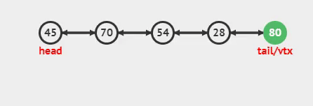
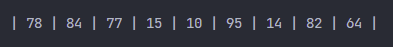
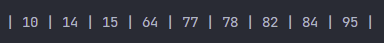

<h1>Lista Doblemente Enlazada</h1>

<p align="justify">Cada nodo (elemento) contiene dos enlaces, uno a su nodo predecesor y el otro a su nodo sucesor. La lista es eficiente tanto en recorrido directo (“adelante”) como en recorrido inverso (“atrás”).</p>

<p align="center"> 
 
</p>

<p align="justify">La característica principal de una lista doble lineal es que los apuntadores del último nodo y del primer nodo apuntan hacia el valor nulo.</p>

<h4>Se presenta una lista de los métodos que usará la clase de Lista simple:</h4>

<ul>
    <li>Crear</li>
    <li>Recorrer Lista</li>
    <li>Tamaño</li>
    <li>Agregar
        <ul>
            <li>Agregar al Inicio</li>
            <li>Agregar al Final</li>
        </ul>
    </li>
    <li>Eliminar
        <ul>
            <li>Eliminar al Inicio</li>
            <li>Eliminar al Final</li>
        </ul>
    </li>
    <li>Esta vacio</li>
    <li>Buscar Dato</li>
</ul>

<h5>Para complementar la lista, necesitamos crear una clase nodo, la cual es la siguiente:</h5>

<h4>Clase NODO:</h4>

```python
class Nodo: 
    def __init__(self, dato): 
        self.dato = dato 
        self.siguiente = None
        self.anterior = None
```

<ul>
    <li>
    <p align="justify">Dato: Dato que contendrá el nodo, string, number, boolean, etc.</p> 
    </li>
    <li><p align="justify">Siguiente: Es el apuntador que contendrá la referencia en memoria del siguiente nodo.</p></li>
    <li><p align="justify">Anterior: Es el apuntador que contendrá la referencia en memoria del anterior nodo.</p></li>
</ul>

<h4>Clase Lista Enlazada Doble:</h4>

```python
from Nodo import Nodo

class ListaDoblementeEnlazada():
  def __init__(self):
    self.primero = None
    self.ultimo = None
    self.size = 0
    ......
```

h4>Métodos de la clase:</h5>

<h5>Esta vacio</h5>
<p align="justify">Método para saber si la lista se encuentra vacía, si esta vacío retorna True, en caso contrario False.</p>

```python
def estaVacio(self): 
    return self.primero == None
```

<h5>Agregar al inicio</h5>
<p align="justify">Inserta los nodos por la cabeza.</p>

```python
def agregarAlInicio(self, dato):
    if self.estaVacio():
        self.primero = self.ultimo = Nodo(dato)
    else:
        aux = Nodo(dato)
        aux.siguiente = self.primero
        self.primero.anterior = aux
        self.primero = aux
    self.size += 1
```

<ul>
    <li>Si la lista esta vacia, tanto la cabeza como la cola apuntaran al nuevo nodo asignado.</li>
    <li>Sino, se agrega el nodo al inicio de la lista, osea al nodo cabeza.</li>
</ul>

<p align="justify">Se asigna el nuevo nodo a aux</p>

```python
aux = Nodo(dato)
```

<p align="justify">Ahora al apuntador siguiente de aux se le dice que almacene la referencia del nodo cabeza.</p>

```python
aux.siguiente = self.primero
```

<p align="justify">Bien, aqui le decimos a la cabeza que en su apuntador anterior almacene la referencia del nodo aux.</p>

```python
self.primero.anterior = aux
```

<p align="justify">Por último, Se le asigna al nodo cabeza, el valor que tiene aux, osea el nuevo nodo, convirtiendose en la nueva cabeza.</p>

```python
self.primero = aux
```

<p align="justify">Como se podrán dar cuenta, en dicho método se le aumenta una variable llamada size osea tamaño en español, y es la encargada de llevar el conteo de nodos, de está manera se lleva un mejor control del conteo de nodos y de la eficiencia de la memoria.</p>

<h4>Demostración gráfica:</h4>
<p align="center">  </p>

<h5>Agregar al final</h5>
<p align="justify">Inserta los nodos por la cola.</p>

```python
def agregarAlFinal(self, dato):
    if self.estaVacio():
        self.primero = self.ultimo = Nodo(dato)
    else:
        aux = self.ultimo
        self.ultimo = aux.siguiente = Nodo(dato)
        self.ultimo.anterior = aux
    self.size += 1
```
0
<ul>
    <li>Si la lista esta vacia, tanto la cabeza como la cola apuntaran al nuevo nodo asignado.</li>
    <li>Sino, se agrega el nodo al final de la lista, osea al nodo cola.</li>
</ul>

<p align="justify">Se asigna a aux el nodo cola.</p>

```python
aux = self.ultimo
```

<p align="justify">Ahora al nodo cola y al apuntador siguiente de aux se les asigna el nuevo nodo.</p>

```python
self.ultimo = aux.siguiente = Nodo(dato)
```

<p align="justify">Por último, al apuntador anterior del nodo cola se le asigna el valor de aux.</p>

```python
self.ultimo.anterior = aux
```

<h4>Demostración gráfica:</h4>
<p align="center">  </p>

<h5>Eliminar al inicio</h5>
<p align="justify">Elimina el primer nodo de la lista.</p>

```python
def eliminarAlInicio(self):
    if self.estaVacio():
        print("Lista vacia")
    elif self.primero.siguiente == None:
        self.primero = self.ultimo = None
        self.size = 0
    else:
        self.primero = self.primero.siguiente
        self.primero.anterior = None
        self.size -= 1
```

<p align="justify">Si la lista se encuentra vacía, se muestra un mensaje diciendo <strong>Lista Vacia</strong>.</p>

<p align="justify">Si la lista no está vacía, preguntamos por el siguiente nodo del nodo cabeza, si es igual a nada o nulo, quiere decir que solo tiene un nodo, por tanto, se limpia la lista y el contador se vuelve cero.</p>

<p align="justify">Si la lista no está vacía, y tiene más de un nodo en la lista, lo que hacemos es al nodo cabeza asignarle la referencia del nodo siguiente al nodo cabeza, luego de esto hacemos que el nodo cabeza en su apuntador anterior sea igual a nulo o que no haga referencia hacia otro nodo,y finalmente el contador disminuye en uno, ya que eliminamos un nodo por la cabeza.</p>

<h4>Demostración gráfica:</h4>
<p align="center">  </p>

<h5>Eliminar al inicio</h5>
<p align="justify">Elimina el primer nodo de la lista.</p>

```python
def eliminarAlFinal(self):
    if self.estaVacio():
        print("Lista vacia")
    elif self.primero.siguiente == None:
        self.primero = self.ultimo = None
        self.size = 0
    else:
        self.ultimo = self.ultimo.anterior
        self.ultimo.siguiente = None
        self.size -= 1
```

<p align="justify">Si la lista se encuentra vacía, se muestra un mensaje diciendo <strong>Lista Vacia</strong>.</p>

<p align="justify">Si la lista no está vacía, preguntamos por el siguiente nodo del nodo cabeza, si es igual a nada o nulo, quiere decir que solo tiene un nodo, por tanto, se limpia la lista y el contador se vuelve cero.</p>

<p align="justify">Si la lista no está vacía, y tiene más de un nodo en la lista, lo que hacemos es que al nodo cola, se le asigna el apuntador anterior del nodo cola, osea almacenando la referencia del penúltimo nodo que se convertirá en el último nodo, lo siguiente que se hace es que al apuntador siguiente del nodo cola tome referencia a nulo, desprendiendose del que era el último nodo, y por último el contador de nodos se le resta uno, por que se borró un nodo.</p>

<h4>Demostración gráfica:</h4>
<p align="center">  </p>

<h5>Recorrido</h5>
<p align="justify">Método para recorrer la lista doble, primero es necesario determinar si la lista contiene elementos. Si no esta vacía se recorre toda la lista desde el nodo cabeza hasta el nodo cola. Mostrando el contenido de cada uno de los nodos de la lista.</p>

```python
def recorrerLista(self): 
    if self.estaVacio(): 
        print("La lista esta vacía\n") 
    aux = self.primero 
    print(end='| ')
    while aux != None: 
        print(aux.dato, end=' | ') 
        aux = aux.siguiente
    print("\n")
```

<h4>Demostración gráfica:</h4>
<p align="center">  </p>

<h5>Buscar un dato en la lista:</h5>
<p align="justify">Método de la clase, para buscar un dato, en caso de que lo encuentre, retorna el valor mas un mensaje de encontrado, en caso de que no lo encuentre retornará el valor enviado anteriormente mas un mensaje.Para el ejemplo siguiente, se busco el número <strong>36.</strong></p>

<h4>Demostración gráfica:</h4>
<p align="center">  </p>

<h5>Tamaño</h5>
<p align="justify">Realiza un conteo de los nodos dentro de la lista, y retorna un valor entero de la cantidad de nodos en la lista.</p>


```python
def tamanio(self):
    return self.size
```
<p align="justify">Tomando como ejemplo la lista anterior mostrada, el método retornará el valor de <strong>9</strong>, ya que nueve son los nodos que se encontraron en la lista.</p>

<p align="justify">Código completo a continuación:</p>

```python
class ListaDoblementeEnlazada():
    def __init__(self):
        self.primero = None
        self.ultimo = None
        self.size = 0

    def estaVacio(self):
        return self.primero == None
    
    def tamanio(self):
        return self.size

    def agregarAlInicio(self, dato):
        if self.estaVacio():
            self.primero = self.ultimo = Nodo(dato)
        else:
            aux = Nodo(dato)
            aux.siguiente = self.primero
            self.primero.anterior = aux
            self.primero = aux
        self.size += 1

    def agregarAlFinal(self, dato):
        if self.estaVacio():
            self.primero = self.ultimo = Nodo(dato)
        else:
            aux = self.ultimo
            self.ultimo = aux.siguiente = Nodo(dato)
            self.ultimo.anterior = aux
        self.size += 1
    
    def eliminarAlInicio(self):
        if self.estaVacio():
            print("Lista vacia")
        elif self.primero.siguiente == None:
            self.primero = self.ultimo = None
            self.size = 0
        else:
            self.primero = self.primero.siguiente
            self.primero.anterior = None
            self.size -= 1
    
    def eliminarAlFinal(self):
        if self.estaVacio():
            print("Lista vacia")
        elif self.primero.siguiente == None:
            self.primero = self.ultimo = None
            self.size = 0
        else:
            self.ultimo = self.ultimo.anterior
            self.ultimo.siguiente = None
            self.size -= 1

    def recorrerLista(self): 
        if self.estaVacio(): 
            print("La lista esta vacía\n") 
        aux = self.primero 
        print(end='| ')
        while aux != None: 
            print(aux.dato, end=' | ') 
            aux = aux.siguiente
        print("\n")
        
    def buscarDato(self, date):
        if self.primero is None:
            print("La lista no tiene elementos")
        aux = self.primero
        while aux is not None:
            if aux.dato == date:
                return (f"{date}, Dato encontrado")
            aux = aux.siguiente
        return (f"{date}, Dato no encontrado")

    def ordenamiento(self):
        actual = aux = None
        if not (self.estaVacio()):
            actual = self.primero
            while (actual.siguiente):
                aux = actual.siguiente
                while (aux):
                    if (aux.dato < actual.dato):
                        tmp = actual.dato
                        actual.dato = aux.dato
                        aux.dato = tmp
                    aux = aux.siguiente
                actual = actual.siguiente
        else:
            print("No hay elementos")
```

<p align="justify">Como 'BONUS', se implementará el método burbuja, para ordenar los valores de la lista.</p>

```python
def ordenamiento(self):
        actual = aux = None
        if not (self.estaVacio()):
            actual = self.primero
            while (actual.siguiente):
                aux = actual.siguiente
                while (aux):
                    if (aux.dato < actual.dato):
                        tmp = actual.dato
                        actual.dato = aux.dato
                        aux.dato = tmp
                    aux = aux.siguiente
                actual = actual.siguiente
        else:
            print("No hay elementos")
```

<p align="justify">Primero, se mostrará la salida de la lista, en este caso será una lista de números desordenados, y al final se mostrará la lista ya ordenada, implementando el método sort.</p>

<h4>Lista sin ordenar:</h4>
<p align="center">  </p>

<h4>Lista ordenar:</h4>
<p align="center">  </p>


<p align="justify">Listo!!!, ahora implementen su lista.</p>

<p align="justify">Referencias:</p>
<ul>
    <li><a href="https://www.studytonight.com/data-structures/doubly-linked-list" target="_blank">Lista Doble(Study tonight)</a></li>
    <li><a href='https://dev.to/ronnymedina/estructura-de-datos-linked-list-lista-enlazada-2h9' target="_blank">DEV</a></li>
    <li>funcionamiento gráfico de la listas simple: <a href='https://visualgo.net/en/list' target="_blank">Visualgo</a></li>
</ul>

<p align="center"><a href="./LISTAS.md">Listas</a></p>