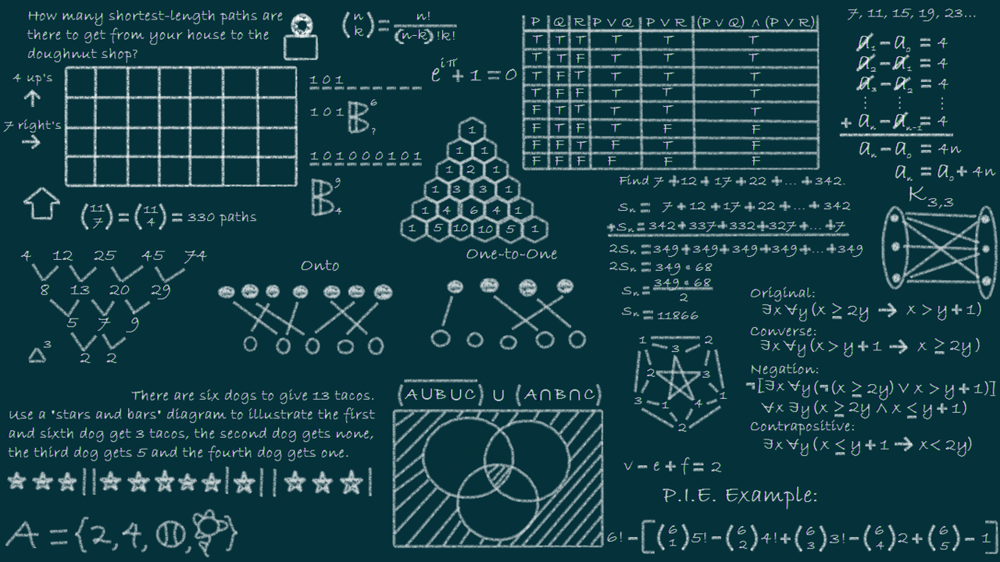

<h1>Introducción a estructura de datos</h1>

La representación de la información es importante, de modo práctico, los requisitos de almacenamiento y tiempo de ejecución exigen que tales programas deban organizar su información de un modo que soporte procesamiento eficiente, Aqui es donde entra el papel fundamental de las estructuras de datos.

  

<h2>¿Qué es una estructura de datos?</h2>

Una estructura de datos es un tipo de dato compuesto que permite almacenar un conjunto de datos de diferente tipo. Los datos que contiene una estructura pueden ser de tipo simple (carácteres, números enteros o de coma flotante, etc.)

A cada uno de los datos o elementos almacenados dentro de una estructura se les denomina miembros de esa estructura y estos pertenecerán a un tipo de dato determinado.

Una estructura de datos puede ser de dos tipos:

<ul>
    <li>
    <h4>Estructuras de datos estáticas:</h4>
    
Son aquellas en las que se asigna una cantidad fija de memoria y no cambia durante la ejecución de un programa, es decir, las variables no pueden crearse ni destruirse durante la ejecución del programa.

    </li>
    <li><h4>Estructuras de datos dinámicas:</h4>
    
Son aquellas en las que su ocupación en memoria puede aumentar o disminuir durante el tiempo de ejecución de un programa.

    
A su vez las estructuras de datos dinámicas se pueden clasificar en lineales y no lineales:

    <ul>
        <li>Estructuras lineales</li>
        <li>Estructuras no lineales</li>
    </ul>
    </li>
</ul>

<h4>Estructuras lineales</h4>

Son aquellas en las que se definen secuencias como conjuntos de elementos entre los que se establece una relación de predecesor y sucesor. Las diferentes estructuras de datos basadas en este concepto se diferencian por las operaciones de acceso a los elementos y manipulación de la estructuras. Existen tres estructuras lineales especialmente importantes: las pilas, las colas y las listas.

 
 
<figcaption>Fig.1 - Estructura lineal</figcaption>

<h3>Nos enfocaremos solamente en estructuras dinámicas</h3>

<ul>
    <li><a href="./LISTAS.md">LISTAS</a></li>
    <li>PILAS</li>
    <li>COLAS</li>
</ul>

