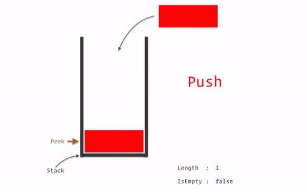
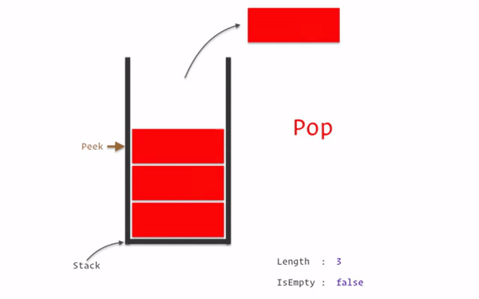
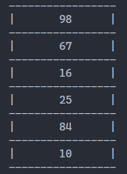

<h1>Introducción a Pilas</h1>

<p align="jsutify">Es una colección de elementos que se agregan y se eliminan siguiendo el principio de <b>último en entrar, primero en salir</b>(<strong>LIFO, Last In-First Out</strong>), es decir, el último elemento insertado en la pila es el primero en ser eliminado.</p>

<p align="center">

</p>

<p align="justify">Un elemento puede ser agregado en cualquier momento a una pila, pero solo puede acceder o eliminar al elemento que esté en la cima o tope de la misma.</p>

<p align="jsutify">Existen dos actividades o eventos que administran los elementos de una pila, dichos eventos son:</p>

<p align="justify"><strong>Apilar o Push:</strong>Cuando se agrega un nuevo elemento en la cima.</p>

<p align="center">

</p>

<p align="justify"><strong>Desapilar o Pop:</strong>Cuando se elimina el elmento que está en la cima.</p>

<p align="center">

</p>

<h4>Se presenta una lista de los métodos que usará la clase de Lista simple:</h4>

<ul>
    <li>Crear</li>
    <li>Apilar</li>
    <li>Desapilar</li>
    <li>Es vacio</li>
    <li>Tamaño</li>
    <li>Listar</li>
    <li>Cima</li>
</ul>

<h5>Para complementar la pila, necesitamos crear una clase nodo, la cual es la siguiente:</h5>

<h4>Clase NODO:</h4>

```python
class Nodo: 
    def __init__(self, dato): 
        self.dato = dato 
        self.siguiente = None
```

<ul>
    <li>
    <p align="justify">Dato: Dato que contendrá el nodo, string, number, boolean, etc.</p> 
    </li>
    <li><p align="justify">Siguiente: Es el apuntador que contendrá la referencia en memoria del siguiente nodo.</p></li>
</ul>

<h4>Clase Pila:</h4>

```python
from Nodo import Nodo

class Pila():
    def __init__(self):
        self.cima = None
        self.tamanio = 0
    ......
```

<h4>Métodos de la clase:</h5>

<h5>Es vacio:</h5>
<p align="justify">Método para saber si la pila se encuentra vacía, si esta vacío retorna True, en caso contrario False.</p>

```python
def esVacio(self):
    return self.cima == None
```

<h5>Apliar o Push:</h5>
<p align="justify">Inserta el elemento sobre la cima de la pila.</p>

```python
def apilar(self, dato):
    self.tamanio += 1
    nuevo_nodo = Nodo(dato)
    if (self.esVacio()):
        self.cima = nuevo_nodo
    else:
        nuevo_nodo.siguiente = self.cima
        self.cima = nuevo_nodo
```

<h5>Desapliar o Pop:</h5>
<p align="justify">Elimina y devuelve el elemento almacenado en la cima de la pila.</p>

```python
def desapilar(self):
    nodo_a_retirar = None
    if (not self.esVacio()):
        nodo_a_retirar = self.cima
        self.cima = self.cima.siguiente
        self.tamanio -= 1
    return nodo_a_retirar
```

<h5>Cima:</h5>
<p align="justify">Devuelve el valor del elemento que está almacenado en la cima de la pila(sin eliminar el elemento de la cima).</p>

```python
def cima(self):
    if self.cima is not None:
        return self.cima.dato
    else:
        return None
```

<h5>Tamaño:</h5>
<p align="justify">Devuelve la cantidad de elementos en la pila.</p>

```python
def getTamanio(self):
    return self.tamanio
```

<h5>Listar:</h5>
<p align="justify">Muestra cada elemento en la pila, recorriendo uno por uno cada elemento de la pila.</p>

```python
def listar(self):
    aux = self.cima
    if (self.esVacio()):
        return print("La pila esta vacia")
    print("-----------------")
    while aux != None:
        print("|\t" + str(aux.dato) + "\t|")
        print("-----------------")
        aux = aux.siguiente
```

<p align="justify">Imaginemos que tenemos los siguientes números en la pila: 98,67,16,25,84. Se muestra los datos en la pila:</p>

<h4>Demostración gráfica:</h4>
<p align="center">

</p>

<p align="justify">Código completo a continuación:</p>

```python
class Nodo: 
    def __init__(self, dato): 
        self.dato = dato 
        self.siguiente = None

class Pila():
    def __init__(self):
        self.cima = None
        self.tamanio = 0
    
    def getTamanio(self):
        return self.tamanio
    
    def esVacio(self):
        return self.cima == None
    
    def cima(self):
        if self.cima is not None:
            return self.cima.dato
        else:
            return None

    def apilar(self, dato):
        self.tamanio += 1
        nuevo_nodo = Nodo(dato)
        if (self.esVacio()):
            self.cima = nuevo_nodo
        else:
            nuevo_nodo.siguiente = self.cima
            self.cima = nuevo_nodo

    def desapilar(self):
        nodo_a_retirar = None
        if (not self.esVacio()):
            nodo_a_retirar = self.cima
            self.cima = self.cima.siguiente
            self.tamanio -= 1
        return nodo_a_retirar
    
    def listar(self):
        aux = self.cima
        if (self.esVacio()):
            return print("La pila esta vacia")
        print("-----------------")
        while aux != None:
            print("|\t" + str(aux.dato) + "\t|")
            print("-----------------")
            aux = aux.siguiente
```

<p align="justify">Listo!!!, ahora implementen su pila.</p>


<p align="justify">Referencias:</p>
<ul>
    <li><a href="https://www.studytonight.com/data-structures/stack-using-linked-list" target="_blank">Pila usando usando lista enlazada(Study tonight)</a></li>
    <li><a href='https://programmerclick.com/article/8696947729/' target="_blank">Programador Click</a></li>
    <li>funcionamiento gráfico de la listas simple: <a href='https://visualgo.net/en/list' target="_blank">Visualgo</a></li>
</ul>

<p align="center"><a href="./Memoriadinamica.md">Inicio</a></p>