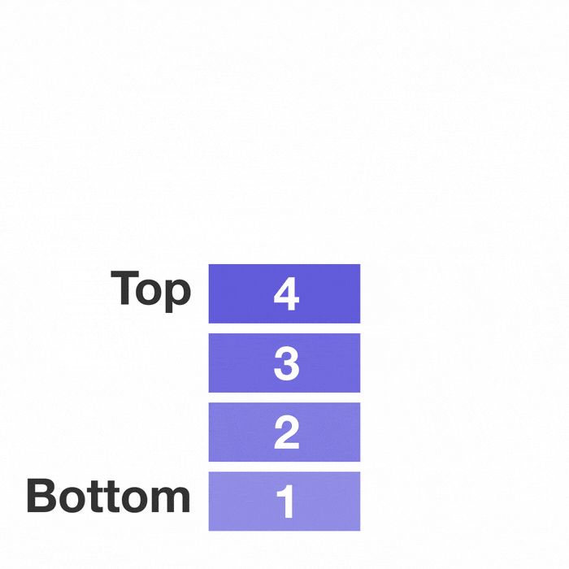

<h1>Introducción a Pilas</h1>

Es una colección de elementos que se agregan y se eliminan siguiendo el principio de <b>último en entrar, primero en salir</b>(<strong>LIFO, Last In-First Out</strong>), es decir, el último elemento insertado en la pila es el primero en ser eliminado.

Un elemento puede ser agregado en cualquier momento a una pila, pero solo puede acceder o eliminar al elemento que esté en la cima o tope de la misma.

Existen dos actividades o eventos que administran los elementos de una pila, dichos eventos son:

<strong>Apilar o Push:</strong>Cuando se agrega un nuevo elemento en la cima.

<strong>Desapilar o Pop:</strong>Cuando se elimina el elmento que está en la cima.

