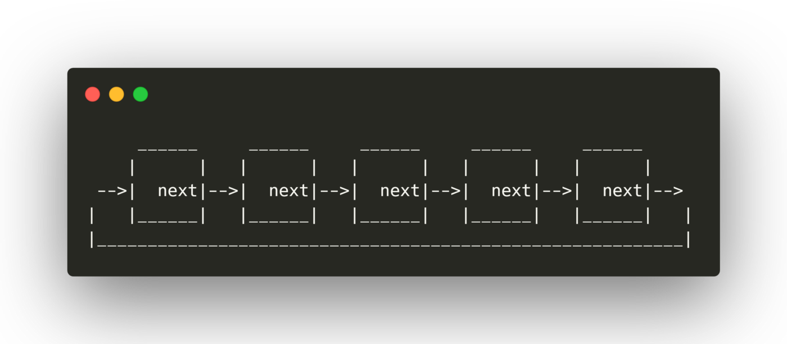
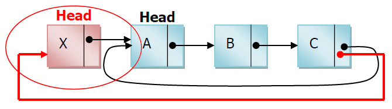
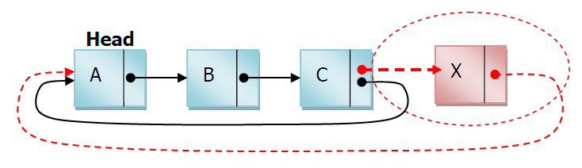
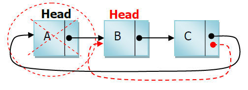
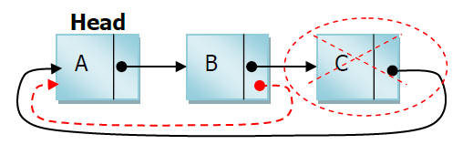
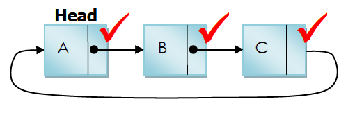
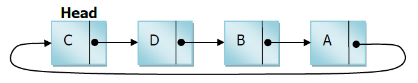

<h1>Lista Circular Simple Enlazada</h1>

<p align="justify">En las listas lineales simples o en las dobles siempre hay un primer nodo (cabeza) y un último nodo (cola). Una lista circular, por propia naturaleza, no tiene ni principio ni fin. Sin embargo, resulta útil establecer un nodo a partir del cual se acceda a la lista y asi poder acceder a sus nodos.</p>

<p align="center"> 

<center><figcaption></figcaption>Lista circular simple,  <a href="https://medium.com/@umarquez_mx">Uriel Márquez</a></center>
</p>

<p align="justify">La característica principal de una lista sencilla circular es que el puntero del último
nodo apunta hacia el primer nodo de la lista. El valor nulo solo se utiliza cuando la lista está vacía.</p>

<h4>Se presenta una lista de los métodos que usará la clase de Lista simple:</h4>

<ul>
    <li>Crear</li>
    <li>Recorrer Lista</li>
    <li>Tamaño</li>
    <li>Agregar
        <ul>
            <li>Agregar al Inicio</li>
            <li>Agregar al Final</li>
        </ul>
    </li>
    <li>Eliminar
        <ul>
            <li>Eliminar al Inicio</li>
            <li>Eliminar al Final</li>
        </ul>
    </li>
    <li>Esta vacio</li>
    <li>Buscar Dato</li>
</ul>

<h5>Para complementar la lista, necesitamos crear una clase nodo, la cual es la siguiente:</h5>

<h4>Clase NODO:</h4>

```python
class Nodo:
    def __init__(self, dato):
        self.dato = dato
        self.siguiente = None
```

<ul>
    <li>
    <p align="justify">Dato: Dato que contendrá el nodo, string, number, boolean, etc.</p> 
    </li>
    <li><p align="justify">Siguiente: Es el apuntador que contendrá la referencia en memoria del siguiente nodo.</p></li>
</ul>

<h4>Clase Lista Enlazada Circular Simple:</h4>

```python
from Nodo import Nodo

class listaEnlazadaSimple():
    def __init__(self):
        self.primero = None
        self.ultimo = None
    ......
```

<h4>Métodos de la clase:</h5>

<h5>Esta vacio</h5>
<p align="justify">Método para saber si la lista se encuentra vacía, si esta vacío retorna True, en caso contrario False.</p>

```python
def estaVacio(self):
    return self.primero == None
```

<h5>Agregar al inicio</h5>
<p align="justify">Inserta los nodos por la cabeza.</p>

```python
def agregarAlInicio(self):
    if self.estaVacio():
        self.primero = self.ultimo = Nodo(dato)
        self.ultimo.siguiente = self.primero
    else:
        aux = Nodo(dato)
        aux.siguiente = self.primero
        self.primero = aux
        self.ultimo.siguiente = self.primero
```

<h4>Demostración gráfica:</h4>
<p align="center">  </p>

<h5>Agregar al final</h5>
<p align="justify">Inserta los nodos por la cola.</p>

```python
def agregarAlFinal(self):
    if self.estaVacio():
        self.primero = self.ultimo = Nodo(dato)
        self.ultimo.siguiente = self.primero
    else:
        aux = self.ultimo
        self.ultimo = aux.siguiente = Nodo(dato)
        self.ultimo.siguiente = self.primero
```

<h4>Demostración gráfica:</h4>
<p align="center">  </p>

<h5>Eliminar al inicio</h5>
<p align="justify">Elimina el primer nodo de la lista.</p>

```python
def eliminarAlInicio(self):
    if self.estaVacio():
        print("Lista vacia!")
    elif self.primero == self.ultimo:
        self.primero = self.ultimo = None
    else:
        self.primero = self.primero.siguiente
        self.ultimo.siguiente = self.primero
```

<h4>Demostración gráfica:</h4>
<p align="center">  </p>

<h5>Eliminar al final</h5>
<p align="justify">Elimina el último nodo de la lista.</p>

```python
def eliminarAlFinal(self):
    if self.estaVacio():
        print("Lista vacia")
    elif self.primero == self.ultimo:
        self.primero = self.ultimo = None
    else:
        aux = self.primero
        while aux.siguiente != self.ultimo:
            aux = aux.siguiente
        aux.siguiente = self.primero
        self.ultimo = aux
```

<h4>Demostración gráfica:</h4>
<p align="center">  </p>

<h5>Recorrido</h5>
<p align="justify">Método para recorrer la lista simple circular, En una lista circular simple no existe el valor nulo, entonces para encontrar el final de la lista es necesario hacer referencia al primer nodo de la lista y tomar en cuenta esto para la condición del ciclo que recorrerá toda la lista.</p>

```python
def recorrido(self):
    if self.estaVacio():
        print("La lista esta vacía\n")
    aux = self.primero
    while aux != None:
        print(aux.dato)
        aux = aux.siguiente
        if aux == self.primero:
            break
    print("\n")
```

<h4>Demostración gráfica:</h4>
<p align="center">  </p>

<h5>Buscar un dato en la lista:</h5>
<p align="justify">Método de la clase, para buscar un dato, es necesario contar con el valor del elemento x recorrer toda la lista desde el primer nodo y comparar el valor de cada nodo que se va recorriendo con el valor del elemento x, hasta que se encuentre el nodo con el valor de x o que se acabe la lista.</p>

```python
def buscarDato(self, dato):
    if self.estaVacio():
        return "La lista no tiene elementos"
    aux = self.primero
    while aux != None:
        if aux.dato == dato:
            return f"{dato}, Dato encontrado"
        aux = aux.siguiente
        if aux == self.primero:
            return f"{dato}, Dato no encontrado"
```

<h4>Demostración gráfica:</h4>
<p align="center">  </p>

<h5>Tamaño</h5>
<p align="justify">Realiza un conteo de los nodos dentro de la lista, y retorna un valor entero de la cantidad de nodos en la lista.</p>

```python
def tamanio(self):
    count = 0
    if self.estaVacio():
        return '0'
    aux = self.primero
    while aux != None:
        count += 1
        aux = aux.siguiente
        if aux == self.primero:
            return count
```

<p align="justify">Código completo a continuación:</p>

```python
class ListaCircular():

def __init__(self):
    self.primero = None
    self.ultimo = None

def isVacia(self):
    return self.primero == None

def agregarAlInicio(self):
    if self.estaVacio():
        self.primero = self.ultimo = Nodo(dato)
        self.ultimo.siguiente = self.primero
    else:
        aux = Nodo(dato)
        aux.siguiente = self.primero
        self.primero = aux
        self.ultimo.siguiente = self.primero

def agregarAlFinal(self):
    if self.estaVacio():
        self.primero = self.ultimo = Nodo(dato)
        self.ultimo.siguiente = self.primero
    else:
        aux = self.ultimo
        self.ultimo = aux.siguiente = Nodo(dato)
        self.ultimo.siguiente = self.primero

def eliminarAlInicio(self):
    if self.estaVacio():
        print("Lista vacia!")
    elif self.primero == self.ultimo:
        self.primero = self.ultimo = None
    else:
        self.primero = self.primero.siguiente
        self.ultimo.siguiente = self.primero

def eliminarAlFinal(self):
    if self.estaVacio():
        print("Lista vacia")
    elif self.primero == self.ultimo:
        self.primero = self.ultimo = None
    else:
        aux = self.primero
        while aux.siguiente != self.ultimo:
            aux = aux.siguiente
        aux.siguiente = self.primero
        self.ultimo = aux

def recorrido(self):
    if self.estaVacio():
        print("La lista esta vacía\n")
    aux = self.primero
    while aux != None:
        print(aux.dato)
        aux = aux.siguiente
        if aux == self.primero:
            break
    print("\n")

def buscarDato(self, dato):
    if self.estaVacio():
        return "La lista no tiene elementos"
    aux = self.primero
    while aux != None:
        if aux.dato == dato:
            return f"{dato}, Dato encontrado"
        aux = aux.siguiente
        if aux == self.primero:
            return f"{dato}, Dato no encontrado"

def tamanio(self):
    count = 0
    if self.estaVacio():
        return '0'
    aux = self.primero
    while aux != None:
        count += 1
        aux = aux.siguiente
        if aux == self.primero:
            return count
```

<p align="justify">Listo!!!, ahora implementen su lista circular simple.</p>


<p align="justify">Referencias:</p>
<ul>
    <li><a href="https://www.studytonight.com/data-structures/circular-linked-list" target="_blank">Lista circular simple(Study tonight)</a></li>
    <li><a href='https://dev.to/ronnymedina/estructura-de-datos-linked-list-lista-enlazada-2h9' target="_blank">DEV</a></li>
</ul>

<p align="center"><a href="./LISTAS.md">Listas</a></p>