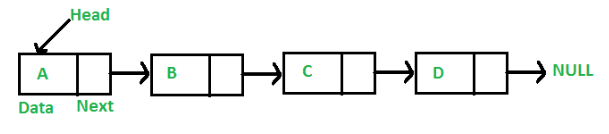
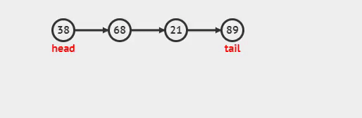

<h1>Lista Simplemente Enlazada</h1>

<p align="justify">Cada nodo (elemento) contiene un único enlace que conecta ese nodo al nodo siguiente o nodo sucesor. La Lista es eficiente en recorridos directos (“adelante”).</p>

<p align="center"> 
 
<figcaption align="center">Fig.4 - Lista simple enlazada</figcaption>
</p>
<p align="justify">La característica principal de una lista sencilla lineal es que la liga del último nodo apunta hacia el valor nulo.</p>

<h4>Se presenta una lista de los métodos que usará la clase de Lista simple:</h4>

<ul>
    <li>Crear</li>
    <li>Recorrer Lista</li>
    <li>Tamaño</li>
    <li>Agregar
        <ul>
            <li>Agregar al Inicio</li>
            <li>Agregar al Final</li>
        </ul>
    </li>
    <li>Eliminar
        <ul>
            <li>Eliminar al Inicio</li>
            <li>Eliminar al Final</li>
        </ul>
    </li>
    <li>Esta vacio</li>
</ul>

<h5>Para complementar la lista, necesitamos crear una clase nodo, la cual es la siguiente:</h5>

<h4>Clase NODO:</h4>

```python
class Nodo: 
    def __init__(self, dato): 
        self.dato = dato 
        self.siguiente = None
```

<ul>
    <li>
    <p align="justify">Dato: Dato que contendrá el nodo, string, number, boolean, etc.</p> 
    </li>
    <li><p align="justify">Siguiente: Es el apuntador que contendrá la referencia en memoria del siguiente nodo.</p></li>
</ul>

<h4>Clase Lista Enlazada Simple:</h4>

```python
from Nodo import Nodo

class listaEnlazadaSimple(): 
    def __init__(self): 
        self.primero = None 
        self.ultimo = None
    ......
```

<h4>Métodos de la clase:</h5>

<h5>Esta vacio</h5>
<p align="justify">Método para saber si la lista se encuentra vacía, si esta vacío retorna True, en caso contrario False.</p>

```python
def estaVacio(self): 
    return self.primero == None
```

<h5>Agregar al inicio</h5>
<p align="justify">Inserta los nodos por la cabeza.</p>

```python
def agregarAlInicio(self): 
    if self.estaVacio(): 
        self.primero = self.ultimo = Nodo(dato)
    else:
        aux = Nodo(dato)
        aux.siguienteNodo = self.primero
        self.primero = aux
```

<ul>
    <li>Si la lista esta vacia, tanto la cabeza como la cola apuntaran al nuevo nodo asignado.</li>
    <li>Sino, se agrega el nodo al inicio de la lista, osea al nodo cabeza.</li>
</ul>

<p align="justify">Se asigna el nuevo nodo a aux</p>

```python
aux = Nodo(dato)
```

<p align="justify">Al nodo nuevo, se le agrega la referencia del nodo que era la cabeza</p>

```python
aux.siguienteNodo = self.primero
```

<p align="justify">Ahora se asigna a la cabeza el nodo aux, que es la nueva cabeza</p>

```python
self.primero = aux
```

<p align="center">  </p>


<h5>Agregar al final</h5>
<p align="justify">Inserta los nodos por la cola.</p>

```python
def agregarAlFinal(self): 
    if self.isEmpty():
        self.primero = self.ultimo = nodoLista(dato)
    else:
        aux = self.ultimo
        self.ultimo = nodoLista(dato)
        aux.siguienteNodo = self.ultimo
```
<ul>
    <li>Si la lista esta vacia, tanto la cola como la cabeza apuntaran al nuevo nodo asignado.</li>
    <li>Sino, se agrega el nodo al final de la lista, osea al nodo cola (último nodo).</li>
</ul>

<p align="justify">Se asigna a aux, la referencia del último nodo que a su vez es el primero.</p>

```python
aux = self.ultimo
```

<p align="justify">Se asigna el nuevo nodo a la referencia del último nodo</p>

```python
self.ultimo = Nodo(dato)
```

<p align="justify">El nodo siguiente almacena la referencia del último nodo en el primer nodo.</p>

```python
aux.siguiente = self.ultimo
```


```python

```

<p align="justify"></p>
<p align="justify"></p>
<p align="justify"></p>
<p align="justify"></p>