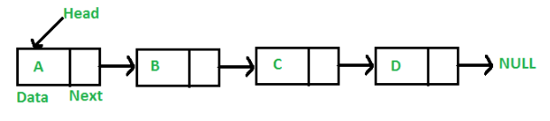
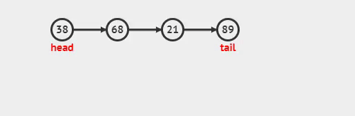
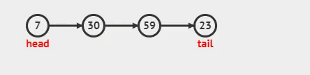
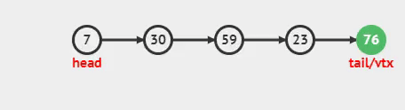
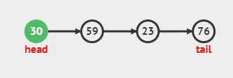
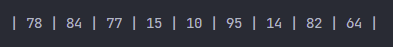
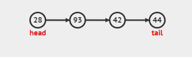
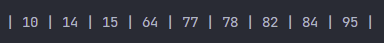

<h1>Lista Simplemente Enlazada</h1>

<p align="justify">Cada nodo (elemento) contiene un único enlace que conecta ese nodo al nodo siguiente o nodo sucesor. La Lista es eficiente en recorridos directos (“adelante”).</p>

<p align="center"> 
 
<figcaption align="center">Fig.4 - Lista simple enlazada</figcaption>
</p>
<p align="justify">La característica principal de una lista sencilla lineal es que la liga del último nodo apunta hacia el valor nulo.</p>

<h4>Se presenta una lista de los métodos que usará la clase de Lista simple:</h4>

<ul>
    <li>Crear</li>
    <li>Recorrer Lista</li>
    <li>Tamaño</li>
    <li>Agregar
        <ul>
            <li>Agregar al Inicio</li>
            <li>Agregar al Final</li>
        </ul>
    </li>
    <li>Eliminar
        <ul>
            <li>Eliminar al Inicio</li>
            <li>Eliminar al Final</li>
        </ul>
    </li>
    <li>Esta vacio</li>
    <li>Buscar Dato</li>
</ul>

<h5>Para complementar la lista, necesitamos crear una clase nodo, la cual es la siguiente:</h5>

<h4>Clase NODO:</h4>

```python
class Nodo: 
    def __init__(self, dato): 
        self.dato = dato 
        self.siguiente = None
```

<ul>
    <li>
    <p align="justify">Dato: Dato que contendrá el nodo, string, number, boolean, etc.</p> 
    </li>
    <li><p align="justify">Siguiente: Es el apuntador que contendrá la referencia en memoria del siguiente nodo.</p></li>
</ul>

<h4>Clase Lista Enlazada Simple:</h4>

```python
from Nodo import Nodo

class listaEnlazadaSimple(): 
    def __init__(self): 
        self.primero = None 
        self.ultimo = None
    ......
```

<h4>Métodos de la clase:</h5>

<h5>Esta vacio</h5>
<p align="justify">Método para saber si la lista se encuentra vacía, si esta vacío retorna True, en caso contrario False.</p>

```python
def estaVacio(self): 
    return self.primero == None
```

<h5>Agregar al inicio</h5>
<p align="justify">Inserta los nodos por la cabeza.</p>

```python
def agregarAlInicio(self): 
    if self.estaVacio(): 
        self.primero = self.ultimo = Nodo(dato)
    else:
        aux = Nodo(dato)
        aux.siguiente = self.primero
        self.primero = aux
```

<ul>
    <li>Si la lista esta vacia, tanto la cabeza como la cola apuntaran al nuevo nodo asignado.</li>
    <li>Sino, se agrega el nodo al inicio de la lista, osea al nodo cabeza.</li>
</ul>

<p align="justify">Se asigna el nuevo nodo a aux</p>

```python
aux = Nodo(dato)
```

<p align="justify">Al nodo nuevo, se le agrega la referencia del nodo que era la cabeza</p>

```python
aux.siguiente = self.primero
```

<p align="justify">Ahora se asigna a la cabeza el nodo aux, que es la nueva cabeza</p>

```python
self.primero = aux
```

<h4>Demostración gráfica:</h4>
<p align="center">  </p>


<h5>Agregar al final</h5>
<p align="justify">Inserta los nodos por la cola.</p>

```python
def agregarAlFinal(self): 
    if self.estaVacio():
        self.primero = self.ultimo = Nodo(dato)
    else:
        aux = self.ultimo
        self.ultimo = Nodo(dato)
        aux.siguiente = self.ultimo
```
<ul>
    <li>Si la lista esta vacia, tanto la cola como la cabeza apuntaran al nuevo nodo asignado.</li>
    <li>Sino, se agrega el nodo al final de la lista, osea al nodo cola (último nodo).</li>
</ul>

<p align="justify">Se asigna a aux, la referencia del último nodo que a su vez es el primero.</p>

```python
aux = self.ultimo
```

<p align="justify">Se asigna el nuevo nodo a la referencia del último nodo</p>

```python
self.ultimo = Nodo(dato)
```

<p align="justify">El nodo siguiente almacena la referencia del último nodo en el primer nodo.</p>

```python
aux.siguiente = self.ultimo
```

<h4>Demostración gráfica:</h4>
<p align="center">  </p>


<h5>Eliminar al inicio</h5>
<p align="justify">Elimina el primer nodo de la lista.</p>

```python
def eliminarAlInicio(self):
    if self.estaVacio():
        print("Lista vacia")
    elif self.primero == self.ultimo:
        self.primero = self.ultimo = None
    else:
        self.primero = self.primero.siguiente
```

<p align="justify">Si la lista se encuentra vacía, se muestra un mensaje diciendo <strong>Lista Vacia</strong>.</p>

<p align="justify">Si la lista NO se encuentra vacía, pregunta si la referencia del nodo cabeza es la misma que la del nodo cola, en caso de que se cumpla, quiere decir que solo existe un nodo, y limpia la lista, quedando vacia.</p>

<p align="justify">En caso de que no se cumplan las anteriores, es por que tiene mas de un elemento en la lista, y se elimina la referencia al primer nodo, simplemente haciendo que la nueva referencia del nodo cabeza sea el siguiente nodo que seguia despues del nodo cabeza.</p>

<h4>Demostración gráfica:</h4>
<p align="center">  </p>

<h5>Eliminar al final</h5>
<p align="justify">Elimina el último nodo de la lista.</p>

```python
def eliminarAlFinal(self):
    if self.estaVacio():
        print("Lista vacia")
    elif self.primero == self.ultimo:
        self.primero = self.ultimo = None
    else:
        aux = self.primero
        while aux.siguiente != self.ultimo:
            aux = aux.siguiente
        aux.siguiente = None
```

<p align="justify">Si la lista se encuentra vacía, se muestra un mensaje diciendo <strong>Lista Vacia</strong>.</p>

<p align="justify">Si la lista NO se encuentra vacía, pregunta si la referencia del nodo cabeza es la misma que la del nodo cola, en caso de que se cumpla, quiere decir que solo existe un nodo, y limpia la lista, quedando vacia.</p>

<p align="justify">En caso de que no se cumplan las anteriores validaciones, se usa aux, para que recorra toda la lista, hasta antes de tener la referencia del último nodo, y se realizan las reasignaciones de referencia de los nodos.</p>

<h4>Demostración gráfica:</h4>
<p align="center">  </p>


<h5>Recorrido</h5>
<p align="justify">Método para recorrer la lista simple, primero es necesario determinar si la lista contiene elementos. Si no esta vacía se recorre toda la lista desde el nodo cabeza hasta el nodo cola. Mostrando el contenido de cada uno de los nodos de la lista.</p>

```python
def recorrerLista(self): 
    if self.estaVacio(): 
        print("La lista esta vacía\n") 
    aux = self.primero 
    while aux != None: 
        print(aux.dato) 
        aux = aux.siguiente
    print("\n")
```

<h4>Demostración gráfica:</h4>
<p align="center">  </p>

<h5>Buscar un dato en la lista:</h5>
<p align="justify">Método de la clase, para buscar un dato, en caso de que lo encuentre, retorna el valor mas un mensaje de encontrado, en caso de que no lo encuentre retornará el valor enviado anteriormente mas un mensaje.Para el ejemplo siguiente, se busco el número <strong>42.</strong></p>

<h4>Demostración gráfica:</h4>
<p align="center">  </p>

```python
def buscarDato(self, dato):
    if self.primero is None:
        return "La lista no tiene elementos"
    aux = self.primero
    while aux is not None:
        if aux.dato == dato:
            return f"{dato}, Dato encontrado"
        aux = aux.siguiente
    return f"{dato}, Dato no encontrado"
```

<h5>Tamaño</h5>
<p align="justify">Realiza un conteo de los nodos dentro de la lista, y retorna un valor entero de la cantidad de nodos en la lista.</p>


```python
def tamanio(self):
    count = 0 
    if self.estaVacio(): 
        return '0'
    aux = self.primero 
    while aux != None: 
        count += 1
        aux = aux.siguiente
    return count
```

<p align="justify">Tomando como ejemplo la lista anterior mostrada, el método retornará el valor de <strong>9</strong>, ya que nueve son los nodos que se encontraron en la lista.</p>

<p align="justify">Código completo a continuación:</p>

```python
class Nodo: 
    def __init__(self, dato): 
        self.dato = dato 
        self.siguiente = None

class listaEnlazadaSimple(): 
    def __init__(self): 
        self.primero = None 
        self.ultimo = None
    
    def estaVacio(self): 
        return self.primero == None
    
    def agregarAlInicio(self, dato): 
        if self.estaVacio(): 
            self.primero = self.ultimo = Nodo(dato)
        else:
            aux = Nodo(dato)
            aux.siguiente = self.primero
            self.primero = aux

    def agregarAlFinal(self, dato): 
        if self.estaVacio():
            self.primero = self.ultimo = Nodo(dato)
        else:
            aux = self.ultimo
            self.ultimo = Nodo(dato)
            aux.siguiente = self.ultimo
    
    def eliminarAlInicio(self):
        if self.estaVacio():
            print("Lista vacia")
        elif self.primero == self.ultimo:
            self.primero = self.ultimo = None
        else:
            self.primero = self.primero.siguiente
    
    def eliminarAlFinal(self):
        if self.estaVacio():
            print("Lista vacia")
        elif self.primero == self.ultimo:
            self.primero = self.ultimo = None
        else:
            aux = self.primero
            while aux.siguiente != self.ultimo:
                aux = aux.siguiente
            aux.siguiente = None
    
    def recorrerLista(self): 
        if self.estaVacio(): 
            print("La lista esta vacía\n") 
        aux = self.primero
        print(end='\n| ')
        while aux != None: 
            print(aux.dato, end=' | ') 
            aux = aux.siguiente
        print("\n")
    
    def tamanio(self):
        count = 0 
        if self.estaVacio(): 
            return '0'
        aux = self.primero 
        while aux != None: 
            count += 1
            aux = aux.siguiente
        return count

    def ordenamientoBurbuja(self):
        actual = aux = None
        if not (self.estaVacio()):
            actual = self.primero
            while (actual.siguiente):
                aux = actual.siguiente
                while (aux):
                    if (aux.dato < actual.dato):
                        tmp = actual.dato
                        actual.dato = aux.dato
                        aux.dato = tmp
                    aux = aux.siguiente
                actual = actual.siguiente
        else:
            print("No hay elementos")
    
    def buscarDato(self, date):
        if self.primero is None:
            print("La lista no tiene elementos")
        aux = self.primero
        while aux is not None:
            if aux.dato == date:
                return (f"{date}, Dato encontrado")
            aux = aux.siguiente
        return (f"{date}, Dato no encontrado")
```

<p align="justify">Como 'BONUS', se implementará el método burbuja, para ordenar los valores de la lista.</p>

```python
def ordenamiento(self):
        actual = aux = None
        if not (self.estaVacio()):
            actual = self.primero
            while (actual.siguiente):
                aux = actual.siguiente
                while (aux):
                    if (aux.dato < actual.dato):
                        tmp = actual.dato
                        actual.dato = aux.dato
                        aux.dato = tmp
                    aux = aux.siguiente
                actual = actual.siguiente
        else:
            print("No hay elementos")
```

<p align="justify">Primero, se mostrará la salida de la lista, en este caso será una lista de números desordenados, y al final se mostrará la lista ya ordenada, implementando el método sort.</p>

<h4>Lista sin ordenar:</h4>
<p align="center">  </p>

<h4>Lista ordenar:</h4>
<p align="center">  </p>


<p align="justify">Listo!!!, ahora implementen su lista.</p>


<p align="justify">Referencias:</p>
<ul>
    <li><a href="https://www.studytonight.com/data-structures/linear-linked-list" target="_blank">Lista simple(Study tonight)</a></li>
    <li><a href='https://dev.to/ronnymedina/estructura-de-datos-linked-list-lista-enlazada-2h9' target="_blank">DEV</a></li>
    <li>funcionamiento gráfico de la listas simple: <a href='https://visualgo.net/en/list' target="_blank">Visualgo</a></li>
</ul>

<p align="justify"><a href="./lts_simple_tda.md">lista simple con TDA</a></p>

<p align="center"><a href="./LISTAS.md">Listas</a></p>