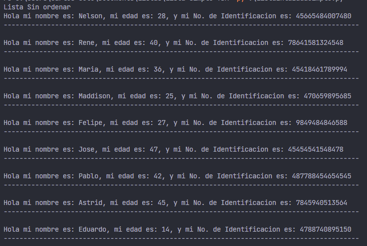
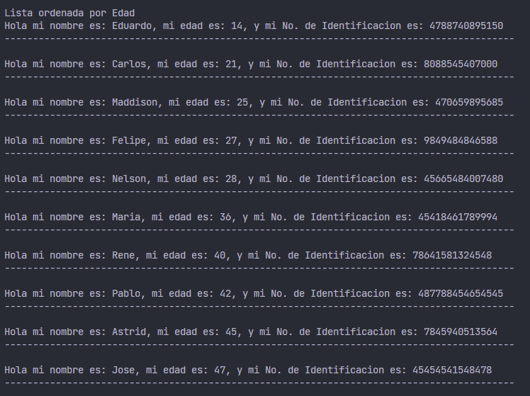
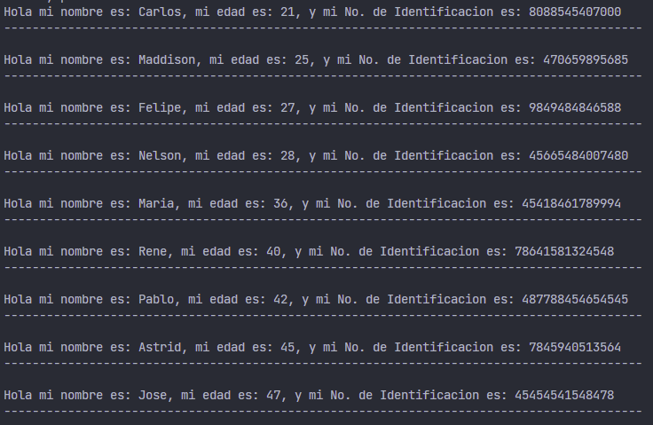

<h1>Lista simple con TDA</h1>

<h2>TDA</h2>
<p align="justify">Es un tipo de dato creado por el programador, puede contener varios tipos de datos propios del lenguaje, es dar el modelo y el conjunto de operaciones correspondientes, expresando con claridad y sin ambigüedad las características de cada una de ellas, su definición debe ser clara y precisa.</p>

<p align="justify">De manera sencilla, un TDA es un dato abstracto que define el programador, yendo de la mano con O.P.P., osea el <strong>paradigma de programación orientada a objetos</strong>. Donde el programador puede crear sus clases y crear una n cantidad de objetos a partir de dicha clase.</p>

<h2>TDA Lista</h2>
<p align="justify">Una lista almacena información del mismo tipo, con la característica de que puede contener un número indeterminado de elementos, y que estos elementos mantienen un orden explícito. Cada elemento contiene la dirección del siguiente elemento. Cada elemento es un nodo de la lista. (Joyanes, Luis, Ignacio Zahonero, 2008) Esto quiere decir que en si mismo la lista y el nodo son TDA´s.</p>

<p align="justify">La implementación del TDA lista requiere del n cantidad de nodos y la lista en si misma con sus métodos correspondientes, sigue siendo el mismo tipo de lista, con los mismos métodos, con la diferencia de que almacena en su dato un dato abstracto.</p>

<p align="justify">Realizemos un ejemplo, para que se comprenda de mejor manera.</p>

<h2>Ejemplo de TDA con lista simple</h2>
<p align="justify">Vamos a hacer uno bastante sencillo, y trabajaremos con la clase Persona, la cual contiene un nombre, edad y un id.</p>

<h3>Clase Persona:</h3>

```python
class Persona():
    def __init__(self, nombre, edad, Id):
        self.nombre = nombre
        self.edad = edad
        self.Id = Id

    def setNombre(self, nombre):
        self.nombre = nombre

    def getNombre(self):
        return self.nombre

    def setEdad(self, edad):
        self.edad = edad

    def getEdad(self):
        return self.edad

    def setId(self, Id):
        self.Id = Id

    def getId(self):
        return self.Id

    def __str__(self):
        return f"Hola mi nombre es: {self.nombre}, mi edad es: {self.edad}, y mi No. de Identificacion es: {self.Id}"
```

<p align="justify">Ahora mostramos la clase Nodo.</p>

```python
class Nodo:
    def __init__(self, dato):
        self.dato = dato
        self.siguiente = None
```

<p align="justify">mostramos la clase de lista simple.</p>

```python
class listaEnlazadaSimple(): 
    def __init__(self): 
        self.primero = None 
        self.ultimo = None
    
    def estaVacio(self): 
        return self.primero == None
    
    def agregarAlInicio(self, dato): 
        if self.estaVacio(): 
            self.primero = self.ultimo = Nodo(dato)
        else:
            aux = Nodo(dato) 
            aux.siguiente = self.primero
            self.primero = aux 

    def agregarAlFinal(self, dato): 
        if self.estaVacio():
            self.primero = self.ultimo = Nodo(dato)
        else:
            aux = self.ultimo
            self.ultimo = Nodo(dato)
            aux.siguiente = self.ultimo
    
    def eliminarAlInicio(self):
        if self.estaVacio():
            print("Lista vacia")
        elif self.primero == self.ultimo:
            self.primero = self.ultimo = None
        else:
            self.primero = self.primero.siguiente
    
    def eliminarAlFinal(self):
        if self.estaVacio():
            print("Lista vacia")
        elif self.primero == self.ultimo:
            self.primero = self.ultimo = None
        else:
            aux = self.primero
            while aux.siguiente != self.ultimo:
                aux = aux.siguiente
            aux.siguiente = None
    
    def recorrerLista(self): 
        if self.estaVacio():
            print("La lista esta vacia\n")
        aux = self.primero
        while aux != None:
            print(aux.dato, '\n')
            print("---------------------------------------------"*2,'\n')
            aux = aux.siguiente
        print("\n")
    
    def tamanio(self):
        count = 0 
        if self.estaVacio(): 
            return '0'
        aux = self.primero 
        while aux != None: 
            count += 1
            aux = aux.siguiente
        return count

    def ordenamientoPorEdad(self):
        actual = aux = None
        if not (self.estaVacio()):
            actual = self.primero
            while (actual.siguiente):
                aux = actual.siguiente
                while (aux):
                    if (aux.dato.getEdad() < actual.dato.getEdad()):
                        tmp = actual.dato
                        actual.dato = aux.dato
                        aux.dato = tmp
                    aux = aux.siguiente
                actual = actual.siguiente
        else:
            print("No hay elementos")
    
    def buscarporNombre(self, nombre):
        if self.primero is None:
            return ("La lista no tiene personas!!!")
        aux = self.primero
        while aux is not None:
            if aux.dato.getNombre() == nombre:
                return aux.dato
            aux = aux.siguiente
        return (f"{nombre}, persona no encontrada")
```

<p align="justify">Como se podrán dar cuenta, prácticamente, sigue siendo la misma clase que vimos en lista simple, la única diferencia es el método de ordenamiento y el método de busqueda,con el de método de ordenamiento nos sirve para ordenar la lista de personas por edad, y en dicho método mandamos a llamar las edades, para poder ordenar la lista en el orden correcto, y el método de busqueda para buscar una persona por su nombre.</p>

<p align="justify">Ahora, vamos a crear una lista:</p>

```python
lista = listaEnlazadaSimple()
```

<p align="justify">Agregamos a la lista elementos lista, con el método de agregación de preferencia.</p>

```python
lista.agregarAlFinal(Persona('Carlos', 21, "8088545407000"))
lista.agregarAlInicio(Persona("Eduardo", 14, "4788740895150"))
lista.agregarAlInicio(Persona("Astrid", 45, "7845940513564"))
lista.agregarAlInicio(Persona("Pablo", 42, "487788454654545"))
lista.agregarAlInicio(Persona("Jose", 47, "45454541548478"))
lista.agregarAlInicio(Persona("Felipe", 27, "9849484846588"))
lista.agregarAlInicio(Persona("Maddison", 25, "470659895685"))
lista.agregarAlInicio(Persona("Maria", 36, "45418461789994"))
lista.agregarAlInicio(Persona("Rene", 40, "78641581324548"))
lista.agregarAlInicio(Persona("Nelson", 28, "45665484007480"))
```

<p align="justify">Podemos recorrer e ir mostrando la lista desordenada:</p>

<h4>Lista sin ordenar:</h4>
<p align="center">  </p>

<p align="justify">Ahora, podemos recorrer e ir mostrando la lista ordenada:</p>

<h4>Lista ordenada:</h4>
<p align="center">  </p>

<p align="justify">Busquemos el nombre de una persona, que tal mmhhmmm Maria!</p>

```python
print(lista.buscarporNombre('Maria'))
```

<p align="justify">Como sabemos que si se encuentra en la lista de personas, se muestra su presentación.</p>

<h4 align="center">Hola mi nombre es: Maria, mi edad es: 36, y mi No. de Identificacion es: 45418461789994</h4>

<p align="justify">Bien, ahora busquemos el nombre de otra persona, que tal Aldair!</p>

```python
print(lista.buscarporNombre('Aldair'))
```

<h4 align="center">Aldair, persona no encontrada</h4>

<p align="justify">Al parecer Aldair no se encuentra en nuestra lista, si revisamos bien, es cierto, no existe en la lista!.</p>

<p align="justify">Intentemos eliminar una persona, que tal la primera persona en la lista, su nombre es Eduardo.</p>

```python
lista.eliminarAlInicio()
```

<p align="justify">Imprimamos nuevamente la lista, para ver si se encuentra Eduardo.</p>

<h4>Lista con el primer elemento(persona) eliminada::</h4>
<p align="center">  </p>

<p align="justify">En efecto, se podrán dar cuenta que Eduardo ya no se encuentra en la lista!!!.</p>

<p align="justify">Como pueden observar, los métodos de la lista simplemente enlazada son sencillos de usar e implementar con TDA's, ahora intenten hacer sus pruebas con el código!!!.</p>

<p align="center"><a href="./lista_simplem.md">Listas simples</a></p>